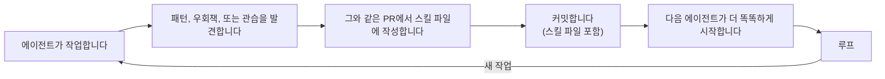
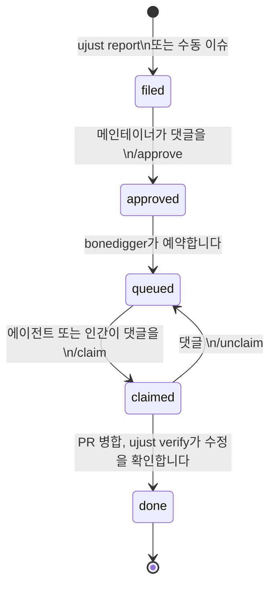

# 에이전트 Bluefin — 기여자 안내

:::info 이 안내는 무엇을 위한 것인가요
이 안내는 `projectbluefin` — Bluefin을 빌드하는 에이전트 팩토리에 기여하는 방법을 설명합니다. 에이전트가 작업을 구현하고, 인간이 설계를 승인하고, PR을 검토하고, 기기가 강제할 수 없는 가드를 실행합니다.
:::

## 변경된 것과 그 이유

Bluefin은 `ublue-os/bluefin` — 사람이 유지보수하는 이미지 — 에서 `projectbluefin/bluefin`으로 재시작했습니다. 이곳은 에이전트가 작업을 구현하고, 사람이 설계와 보안 민감 변경, 병합을 승인하는 팩토리입니다.

재시작은 2026년 5월 말 4–5일이 걸렸습니다. Jorge가 설명하듯이:

> 저는 에이전트로 Bluefin을 재건하기 위해 4-5일 스프린트를 했습니다. Andy Anderson처럼 정말 이것을 잘 설명한 많은 똑똑한 AI 사람들이 저를 도왔습니다. 그러자 이건 명백해졌습니다. Bluefin 2.0.
>
> — Jorge Castro, _[THEPATTERN.md](https://github.com/projectbluefin/bluefin/blob/0c41935a077b5fbb8d8367ffe14770f361e78ed2/THEPATTERN.md)_

`ublue-os/bluefin`과 `projectbluefin/bluefin` 사이의 변경된 것에 대한 완전한 기술 비교는 **[THEPATTERN.md](https://github.com/projectbluefin/bluefin/blob/0c41935a077b5fbb8d8367ffe14770f361e78ed2/THEPATTERN.md)**를 확인하세요.

---

## 팩토리가 돌아가고 있습니다

에이전트 팩토리가 가동되어 매일 출하합니다.

**가동 중인 것:**

- 키리스 서명, 병합 큐, 빠른 PR 검증 (1–2분)
- `pr-smoke.yml` — 빌드에 영향을 주는 경로를 건든 PR의 완전한 이미지 빌드 + 스모크 테스트
- `post-testing-e2e.yml` — `testing`으로의 모든 푸시에 `smoke,common` 스위트 실행
- `nightly.yml` — `:latest`에 대한 야간 `smoke,common,vanilla-gnome` 기준 실행
- `promote-testing-to-main.yml` — 병합 큐로 매일 자동화 촉진 PR; `execute-release.yml`은 `main`으로의 푸시 시 `:stable`을 출하합니다
- `bluefin`과 `dakota`가 소비하는 `projectbluefin/actions` 공유 CI 라이브러리
- `bonedigger` 이슈 라이프사이클 봇
- AI Moderator (`moderator.yml`) — 이슈와 PR 코멘트에 대한 스팸 감지 및모더레이션

**아직 진행 중:**

- ARM 빌드 — CI에 연결되었지만 akmods ARM 지원이 나올 때까지 비활성화

**기여자로서 이것이 의미하는 바:**

이 시스템은 의도적으로 빠르게 움직입니다. 무언가가 깨지면 정확한 응답은 이슈를 제기하고 수정하는 것입니다. 설계 가정은 가드 (2인 승인 + e2e + SHA 잠금)가 개별 구성 요소가 여전히 성숙하는 동안에도 사용자를 보호한다는 것입니다.

---

## 당신이 합류하는 시스템

Bluefin의 에이전트 팩토리는 **[KubeStellar Hive](https://hive.projectbluefin.io/)** 가 오케스트레이션합니다. 이것은 AI-네이티브 지속 전달 시스템입니다. 아키텍처는 이렇습니다:

```mermaid
flowchart TB
    subgraph hive["KubeStellar Hive — hive.projectbluefin.io"]
        direction TB
        acmm["AI-네이티브 지속 성숙 모델\nAI 에이전트가 점차 높아지는 자율성 수준에서 작동"]
    end

    hive --> bonedigger
    hive --> kubestellar_bot

    subgraph bonedigger["bonedigger (projectbluefin/bonedigger)"]
        direction TB
        ujust["ujust report\n(사용자가 자신의 시스템에서 실행)"]
        bot["GitHub Actions 라이프사이클 봇"]
        ujust --> bot
    end

    subgraph kubestellar_bot["kubestellar-bot (레포지토리 자동화)"]
        direction TB
        picks["큐의 이슈를 잡습니다"]
        dispatches["에이전트를 구현하도록 파견합니다"]
        ships["PR을 이미지 레포지토리로 되돌려 출하합니다"]
        picks --> dispatches --> ships
    end

    bonedigger -->|이슈를 제기합니다| image_repos
    kubestellar_bot -->|PR을 엽니다| image_repos

    subgraph image_repos["이미지 레포지토리"]
        direction LR
        bluefin["projectbluefin/bluefin\n(Fedora 기반)"]
        common["projectbluefin/common\n(공유 OCI 레이어)"]
        dakota["projectbluefin/dakota\n(BuildStream / distroless)"]
    end

    image_repos -->|출하합니다| loop["더 나은 OS\n↓\n더 나은 bonedigger\n↓\n루프"]
    loop -->|더 많은 보고서| bonedigger

    style hive fill:#2d3a5a
    style bonedigger fill:#3a4a2a
    style kubestellar_bot fill:#4a3a2a
    style image_repos fill:#2a3a4a
```



### 구성 요소

**[KubeStellar Hive](https://hive.projectbluefin.io/)** 가 오케스트레이션 계층입니다. 이것은 `projectbluefin` org의 7개 레포지토리를 관리합니다 (`bluefin`, `common`, `dakota`, `actions`, `renovate-config`, `bonedigger`, `knuckle`). [hive.projectbluefin.io](https://hive.projectbluefin.io)에서 실시간으로 작동하는 것을 볼 수 있습니다.

**[bonedigger](https://github.com/projectbluefin/bonedigger)**는 클라이언트 + 라이프사이클 봇입니다. Bluefin 시스템에서, 사용자는 `ujust report`를 실행합니다 — 에이전트는 사람이 수동으로 모으기 어려운 시스템 진단을 모으고, 디바이스에서 PII를 지우며, 관련 이미지 레포지토리로 이슈를 제기합니다. GitHub Actions 라이프사이클 봇은 파이프라인을 관리합니다: `filed → approved → queued → claimed → done`.

**kubestellar-bot**은 레포지토리 자동화 계층입니다. 큐의 이슈를 잡고, 에이전트를 구현하도록 파견하며, `testing` 브랜치에 대한 PR로 되돌려 출하합니다.

**[Project Bluefin MCP](https://mcp.projectbluefin.io/mcp)** (`mcp.projectbluefin.io`)은 기여자 에이전트를 위한 공개 Model Context Protocol 엔드포인트입니다. 이것은 토큰 없이 org 지식 저장소와 실시간 Hive 팩토리 상태 (`search_knowledge`, `get_factory_status`, `get_work_queue`)에 접근합니다.

**당신**은 이 시스템의 인간입니다. 당신의 작업은 설계를 승인하고, 에이전트 PR을 검토하고, 무엇을 거부할지 결정하고, 기기가 강제할 수 없는 가드를 실행하는 것입니다.

---

## KubeStellar Hive와 AI Codebase 성숙 모델에 대하여

:::info 출처
이 섹션의 사실은 1차 출처에서 나옵니다. 이 요약에 의존하기보다는 그 출처를 읽으세요.

- Anderson, A. _The AI Codebase Maturity Model: From Assisted Coding to Fully Autonomous Systems._ [arXiv:2604.09388](https://arxiv.org/abs/2604.09388)
- CNCF 블로그 (2026-05-14): [_When AI agents become contributors: How KubeStellar reached 81% PR acceptance_](https://www.cncf.io/blog/2026/05/14/when-ai-agents-become-contributors-how-kubestellar-reached-81-pr-acceptance/)
- The New Stack (2026): [_Beyond prompting: How KubeStellar reached 81% PR acceptance with AI agents_](https://thenewstack.io/ai-codebase-maturity-model/)
- [projectbluefin-dot-github/AGENTS.md](https://github.com/projectbluefin/.github/blob/main/AGENTS.md) — org 운영 모델
  :::

### Andy Anderson와 ACMM

KubeStellar Hive는 **Andy Anderson** — IBM의 시니어 플랫폼 엔지니어이자 아키텍터, 4년간 KubeStellar의 수석 메인테이너, 그리고 CNCF 프로젝트 스튜어드 — 가 설계했습니다. Hive는 그의 **AI Codebase Maturity Model (ACMM)** 의 참조 구현입니다.

ACMM은 코드베이스가 기본적인 AI 보조 프로그래밍에서 완전 자율 시스템으로 어떻게 진화하는지를 설명합니다. 이 모델은 5개의 점진적 수준을 중심으로 구성됩니다 (arXiv:2604.09388), 6번째 "Fully Autonomous" 수준이 논문의 섹션 5에서 Hive를 위해 도입되었습니다:

| 수준 | 이름                 | 핵심 피드백 루프                                                                                                 |
| ---- | -------------------- | ---------------------------------------------------------------------------------------------------------------- |
| 1    | **Assisted**         | 정교한 자동완성으로서의 AI — 지속적인 맥락이나 산출물 없음                                                       |
| 2    | **Instructed**       | 파일에 인코딩된 명시적 선호 (CLAUDE.md, AGENTS.md, copilot-instructions.md) — 재현 가능한 일관성 제공            |
| 3    | **Measured**         | 테스트 스위트, 커버리지 지표, 지속 모니터링 인프라가 정량적 평가 제공                                            |
| 4    | **Adaptive**         | 자동화된 응답이 피드백 루프를 닫습니다 — 자동 튜닝, 동적 우선순위 지정, 오류 분류                                |
| 5    | **Self-Sustaining**  | 코드베이스가 정책과 우선순위를 인코딩하는 살아있는 명세로 변합니다; 에이전트가 최소한의 인간 개입으로 구현합니다 |
| 6    | **Fully Autonomous** | Hive — 참조 구현 (논문 §5에서 도입)                                                                              |

요약에서:

> "각 수준은 그 피드백 루프 토포지로 정의됩니다 — 다음 수준이 가능해지기 전에 존재해야 하는 특정 메커니즘입니다. 수준을 건너뛸 수 없고, 각 수준에서 다음 것을 열어주는 것은 또 다른 피드백 메커니즘입니다."

논문의 핵심 발견:

> **"AI 기반 개발 시스템의 지능은 그 주변의 AI 모델 자체에 있는 것이 아니라, 지시와 테스트, 지표, 피드백 루프의 인프라에 있습니다."**

### Hive의 보고된 지표

아래의 숫자는 ACMM 논문의 **KubeStellar Console** 사례 연구와 CNCF 블로그에서 나왔습니다 — 82일 측정 기간입니다.

| 지표                                 | 값                         | 출처               |
| ------------------------------------ | -------------------------- | ------------------ |
| PR 승인율                            | 81%                        | CNCF 블로그, arXiv |
| 코드 커버리지                        | 12개 샤드에서 91%          | CNCF 블로그        |
| CI/CD 워크플로우                     | 63                         | CNCF 블로그        |
| 야간 테스트 스위트                   | 32                         | CNCF 블로그        |
| 버그-병합-수정                       | 30분 미만                  | CNCF 블로그        |
| PR 처리량 향상 (Level 2 → Level 6)   | 5×                         | arXiv 요약         |
| 이슈 처리량 향상 (Level 2 → Level 6) | 37×                        | arXiv 요약         |
| Hive Bluefin SLA 목표                | < 30분 이슈-제기 → PR-병합 | arXiv 요약         |
| Hive Bluefin 범위                    | 6개 레포지토리             | arXiv 요약         |

Hive가 수행하는 특정 자동화 (CNCF 블로그에서): 15분마다 레포지토리 분류; 60초마다 PR 빌드 모니터링; 지수 백오프로 오류 복구; 오류 급증에 대한 시간별 분석 쿼리.

Hive에서의 크로스 에이전트 메모리 연속성은 **Beads**라는 시스템으로 처리됩니다 (arXiv 요약).

### Bluefin에 직접적으로 중요한 발견

사례 연구에서 (CNCF 블로그):

> _"자율 워크플로우의 불안정한 테스트는 신뢰 모델의 침식입니다."_

85% 신뢰성을 가진 단일 테스트가 시스템 전반에 걸쳐 실패를 전파했습니다. 이것이 Bluefin 테스트-suite가 작성되었지만 결정적이지 않은 시나리오에 대해 `@quarantine` 태그를 사용하는 이유입니다. 불안정한 가드는 가드가 없는 것보다 더 나쁩니다.

### ACMM이 Bluefin의 현재 구현에 어떻게 매핑되는지

| ACMM 수준                          | Bluefin에서 대응하는 것                                                                     |
| ---------------------------------- | ------------------------------------------------------------------------------------------- |
| Instructed                         | `AGENTS.md`, `docs/SKILL.md`, 각 레포지토리의 `.github/skills/` 파일                        |
| Measured                           | 다중 스위트 테스트-suite + 야간 기준 + 2인 생산 Environment 가드                            |
| Adaptive                           | Renovate automerge, AI Moderator, `hive-progress-sync.yml`                                  |
| Self-Sustaining / Fully Autonomous | 활성 궤도; 8개 레포지토리를 관리하며 kubestellar-bot이 에이전트를 파견하는 KubeStellar Hive |

모든 수준에서 인간의 역할은 동일합니다: 무엇을 만들지 결정하고, 무엇을 거부할지 결정하고, "좋음"이 무엇을 의미하는지 정의합니다. Anderson의 논문은 이에 대해 명시적입니다: "인간 감독은 여전히 무엇을 만들지, 무엇을 거부할지, 품질 기준을 정의하는 것에 대한 결정의 출처입니다."

---

## 네 가지 가드 — 인간이 결정하는 곳

에이전트는 이 네 가지 가드에서 제외하고 자율적으로 구현합니다. 이 중 하나를 만나면 멈추고 인간의 입력을 요청하세요. 에이전트 PR을 검토하는 인간 기여자라면, 당신의 판단이 가장 필요한 순간입니다.

| 가드              | 트리거 시점                                                                                        | 할 일                                                                                              |
| ----------------- | -------------------------------------------------------------------------------------------------- | -------------------------------------------------------------------------------------------------- |
| **Design Gate**   | 아키텍터 변경, 새 subsystem 설계, 사용자에게 보이는 동작 변경                                      | 제안서와 함께 초안 PR이나 이슈를 엽니다. 만들기 전에 명시적 승인을 기다리세요.                     |
| **Security Gate** | 인증, 서명, 공급망, 비밀 처리, COPR/3자 출처                                                       | 멈추세요. 찾은 것과 제안하는 것을 평범하게 게시하세요. 메인테이너가 승인할 때까지 구현하지 마세요. |
| **Breakage Gate** | 크로스 레포지토리 파괴적 변경 — 입력 제거/이름 변경, 소비하는 레포지토리에 영향을 주는 기본값 변경 | 영향을 받는 레포지토리를 열거하세요. 코드를 건지기 전에 이슈를 엽니다.                             |
| **Merge Gate**    | 최종 PR 승인 — 항상 인간                                                                           | 에이전트는 자신의 PR을 승인하지 않습니다. 생산 빌드에 대한 2명의 다른 인간 (기기 강제)             |

의심이 든다면, 당신의 구현과 함께 초안 PR을 열고 명시적으로 물으세요. 이 시스템은 침묵하는 자율적 행동보다 가드에서 과도한 커뮤니케이션을 선호합니다.

---
## 자기개선 루프

모든 에이전트 세션은 두 가지 산출물을 생산해야 합니다:

1. **작업** — PR, 수정, 또는 개선.
2. **학습** — 미래 에이전트가 알아야 할 것을 에이전트가 발견한 것.

출물 1만 있고 출물 2가 없으면 시스템이 더 똑똑해지지 않습니다. 에이전트가 다시 작성할 때만 루프가 복리 효과를 냅니다. org AGENTS.md가 말하듯이:



### 다시 작성할 가치가 있는 학습

**작성하세요:**

-upstream 버그것에 대한 우회책 (구성 요소 + 이슈 링크 포함)

- 정확성을 위해 필요한 비명백한 패턴
- 코드에서 명백하지 않은 관습
- 시도와 오류로 발견한 것

**작성하지 마세요:**

- 단발성 작업 메모 ("이 PR에 커밋 메시지 X를 사용하세요")
- 누구나 아는 당연한 것
- 일시적 상태 ("현재 깨져 있음, 수정 대기 중")

### 스킬 파일이 어디에 있는지

| 작업하는 곳                           | 작성할 곳                                                                |
| ------------------------------------- | ------------------------------------------------------------------------ |
| `projectbluefin/actions`              | `docs/skills/` (Copilot CLI) AND `.github/skills/` (Cloud Agent)         |
| 다른 모든 `projectbluefin` 레포지토리 | 그 레포지토리의 `.github/skills/` — 없으면 생성                          |
| 크로스 커팅 (여러 레포지토리에 영향)  | 로컬에서 먼저, 그런 다음 `projectbluefin/actions`에서 전파 이슈를 엽니다 |

### 검토가 필요한 것을 찾는 곳

**[queue.projectbluefin.io](https://queue.projectbluefin.io/)** — Clanker Control Panel — 는 org 전반에 걸친 인간의 결정을 기다리는 모든 것에 대한 실시간 뷰입니다. 이것은 승인 카운트와 함께 검토 상태로 분류된 열린 PR과 우선순위 열의 hive P0/P1 이슈를 보여줍니다.

**기계 읽기 가능한 검토 브리핑**이 여기서 사용 가능합니다:

**https://queue.projectbluefin.io/review-guide.md**

이 문서는 레포지토리별 병합 규칙, PR에서 확인할 것, 네 가지 인간 가드 (Design / Security / User Impact / Promotion), hive 라벨 체계, 추적된 레포지토리, 그리고 빠른 참조 스크립트 명령을 다룹니다. 에이전트와 인간 모두 `curl`로 HTML을 스크래핑하지 않고 구조화된 읽기 가능한 브리핑을 얻을 수 있습니다.

대시보드 뒤의 원시 데이터도 `https://queue.projectbluefin.io/data.json`에서 기계 접근 가능합니다 (10분마다 업데이트).

### 인간이 검토에서 확인할 것

에이전트 PR을 검토할 때, 확인하세요:

- 에이전트가 이 같은 PR에서 `.github/skills/` 업데이트를 커밋했나요?
- 그 업데이트에서 설명된 학습이 실제적이고 비명백한가요?
- 작업한 영역에 대한 스킬 파일이 있으면, 그것이 업데이트되었나요?

CI, 빌드, 또는 패키징을 건든 스킬 파일 업데이트가 없는 PR은 노란 깃발입니다. 아무것도 자동으로 경보하지 않습니다 — skill-drift 체크는 은퇴했습니다 — 그래서 이것은 검토자가 내려야 하는 판단입니다.

---
## 레포지토리 맵

### 핵심 이미지 레포지토리

| 레포지토리                                                                            | 역할                                                       | 인간이 기여하는 것                        |
| ------------------------------------------------------------------------------------- | ---------------------------------------------------------- | ----------------------------------------- |
| [projectbluefin/bluefin](https://github.com/projectbluefin/bluefin)                   | 메인 OS 이미지 (Fedora 기반)                               | 설계 결정, PR 검토, `testing`-브랜치 수정 |
| [projectbluefin/common](https://github.com/projectbluefin/common)                     | 공유 OCI 레이어 — 데스크톱 설정, ujust, GNOME 의견         | 모든 변형에 적용되는 공유 동작            |
| [projectbluefin/aurorafin-shared](https://github.com/projectbluefin/aurorafin-shared) | Aurora와 Bluefin을 위한 공유 시스템 파일                   | 크로스 프로젝트 공유 설정                 |
| [projectbluefin/dakota](https://github.com/projectbluefin/dakota)                     | Distroless 프로토타입 (Dakotaraptor, BuildStream)          | 실험적; actions 라이브러리 연결           |
| [projectbluefin/actions](https://github.com/projectbluefin/actions)                   | 공유 CI 라이브러리 — 10개 composite action, 스킬 파일 허브 | CI/actions 개선; 스킬 파일 전파           |
| [projectbluefin/bonedigger](https://github.com/projectbluefin/bonedigger)             | 클라이언트 보고 + 이슈 라이프사이클 봇                     | 클라이언트 UX, 라이프사이클 봇 동작       |

```mermaid
flowchart TB
    common["projectbluefin/common\n(공유 OCI 레이어)"]
    shared["projectbluefin/aurorafin-shared\n(Aurora+Bluefin 공유 설정)"]

    common --> bluefin
    common --> dakota
    shared --> bluefin

    subgraph images["이미지 레포지토리"]
        bluefin["projectbluefin/bluefin\n(Fedora 기반)"]
        dakota["projectbluefin/dakota\n(BuildStream / distroless)"]
    end

    testsuite["projectbluefin/testsuite\n(E2E 가드)"]

    bluefin -->|smoke 가드| testsuite
    testsuite -->|촉진 차단| stable[":stable"]

    iso["projectbluefin/iso\n(설치 미디어)"]
    stable --> iso

    style common fill:#2d3a5a
    style shared fill:#2d3a5a
    style images fill:#3a4a2a
    style testsuite fill:#4a3a2a
```



### 인프라 레포지토리

| 레포지토리                                                                          | 역할                                                                 |
| ----------------------------------------------------------------------------------- | -------------------------------------------------------------------- |
| [projectbluefin/actions](https://github.com/projectbluefin/actions)                 | 공유 CI action과 org 전체 자동화 (housekeeping는 더 이상 사용 안 함) |
| [projectbluefin/renovate-config](https://github.com/projectbluefin/renovate-config) | 자체 호스트 Renovate 설정 — GitHub App 인증, PAT 없음                |
| [projectbluefin/testsuite](https://github.com/projectbluefin/testsuite)             | QA 파이프라인 — Argo Workflows + KubeVirt + AT-SPI 테스트            |
| [projectbluefin/testing-lab](https://github.com/projectbluefin/testing-lab)         | Homelab QA 파이프라인                                                |
| [projectbluefin/bluespeed](https://github.com/projectbluefin/bluespeed)             | KubeStellar homelab 팩토리                                           |
| [projectbluefin/iso](https://github.com/projectbluefin/iso)                         | ISO 빌드                                                             |
| [projectbluefin/dakota-iso](https://github.com/projectbluefin/dakota-iso)           | Dakota를 위한 부팅 가능한 UEFI live ISO                              |
| [projectbluefin/bootc-installer](https://github.com/projectbluefin/bootc-installer) | libadwaita bootc 설치기 (Vanilla OS 설치기의 포크)                   |
| [projectbluefin/finpilot](https://github.com/projectbluefin/finpilot)               | 나만의 커스텀 Bluefin 만들기                                         |

### 소비하는 레포지토리 (ublue-os에 남음)

| 레포지토리                                              | 역할      |
| ------------------------------------------------------- | --------- |
| [ublue-os/aurora](https://github.com/ublue-os/aurora)   | KDE 변형  |
| [ublue-os/bazzite](https://github.com/ublue-os/bazzite) | 게임 변형 |

Aurora와 Bazzite는 `projectbluefin/common`을 소비하지만 `ublue-os` org에서 유지보수합니다. org 전체의 강한 규칙을 잊지 마세요: 에이전트는 **절대** 어떤 `ublue-os/*` 레포지토리도 겨냥한 이슈, PR, 코멘트, 또는 작성하는 action을 만들면 안 됩니다 (읽기 전용 `gh api` 검사는 허용됨).

---
## 빌드와 촉진 파이프라인

`git push`와 `:stable` 사이의 변경이 어떻게 되는지:

```mermaid
flowchart TB
    pr["PR을 엽니다\ntesting 브랜치에 대한 것"]

    pr --> validation["pr-validation.yml\n1–2분\njust check + shellcheck\n+ hadolint + pre-commit\n+ bats 유닛 테스트"]

    pr --> smoke_check{"빌드 경로를\n건드렸나요?"}
    smoke_check -->|예| prsmoke["pr-smoke.yml\n완전한 이미지 빌드\n+ 스모크 스위트\n병렬로 실행"]

    validation -->|통과, merge_group| merge["squash 병합\ntesting 브랜치에"]

    merge --> build["build.yml\n(Testing 이미지)\n모든 변형 빌드\n약 26분\ntesting으로의 푸시에 트리거"]

    build -->|다이제스트가 게시됩니다| e2e["post-testing-e2e.yml\nsmoke + common 스위트\nQEMU VM + AT-SPI\n촉진을 차단합니다"]

    e2e -->|성공 시| promotion["promote-testing-to-main.yml\n1. 매일 04:00 UTC / 푸시에\n2. testing HEAD SHA를 잠급니다\n3. main에 대한 PR을 열거나 업데이트합니다\n4. 병합 큐가 자동 병합합니다\n   (0 승인 필요)"]

    promotion --> release["execute-release.yml\nmain으로의 푸시에 트리거\nskopeo copy :testing@digest → :stable/:latest\n다이제스트 잠금"]

    release --> stable[":stable / :latest\nSHA 잠금\n초기의 다이제스트 = 끝의 다이제스트"]

    validation -->|실패| reject1["PR이 차단됩니다\n수정하고 푸시하세요"]
    prsmoke -->|실패| reject2["빌드 또는 스모크 실패\n고위험 Renovate automerge를 차단합니다"]
    e2e -->|실패| reject3["촉진이 차단됩니다\n레포지토리에서 보이는 스모크 실패"]

    style validation fill:#2d4a2d
    style prsmoke fill:#2d3a5a
    style build fill:#2d3a5a
    style e2e fill:#4a3a2a
    style promotion fill:#4a2a2a
    style release fill:#2a4a2a
    style stable fill:#2a4a2a
```



### 각 단계가 검증하는 것

| 단계                                           | 검증하는 것                                                                                                                                | 차단하는 것                     |
| ---------------------------------------------- | ------------------------------------------------------------------------------------------------------------------------------------------ | ------------------------------- |
| `pr-validation.yml` (약 1–2분)                 | `just check`, shellcheck, hadolint, pre-commit, bats 유닛 테스트                                                                           | 모든 린트 실패                  |
| `pr-smoke.yml` (빌드에 영향을 주는 PR만)       | 완전한 이미지 빌드 + 스모크 테스트 스위트 — Containerfile, Justfile, image-versions.yml, build_files/, 또는 system_files/이 변경될 때 실행 | 빌드 실패 또는 스모크 실패      |
| `build.yml` (약 26분)                          | 완전한 이미지 빌드, 모든 변형; testing으로의 푸시에 트리거                                                                                 | 빌드 실패                       |
| `post-testing-e2e.yml`                         | QEMU VM에서 AT-SPI로 `smoke,common` 스위트                                                                                                 | 시나리오가 하나도 실패하지 않음 |
| `promote-testing-to-main.yml` (매일 04:00 UTC) | testing SHA를 잠그고, e2e를 검증하고, main에 대한 squash PR을 열며, 병합 큐를 통해 자동 병합합니다 (0 승인 필요)                           | e2e 통과가 없거나 병합 충돌     |
| `execute-release.yml`                          | main으로의 푸시에 발동합니다; `skopeo copy :testing@<digest> → :latest, :stable`                                                           | 복사 또는 릴리스 실패           |
| `nightly.yml` (매일 02:00 UTC)                 | `:latest`에 대한 `smoke,common,vanilla-gnome` 스위트 — vanilla-gnome 기준은 Bluefin 특화 회귀를upstream GNOME 회귀와 구분합니다            | 권유성; 병합을 차단하지 않음    |

### 새 모델에서 "`:stable`"이 의미하는 것

`:stable`로 태그된 이미지는 다음을 가집니다:

1. 촉진되는 정확한 이미지를 실행하는 가상 머신에서 `smoke,common` 자동화 시나리오를 통과했습니다
2. `testing` 브랜치에서 빌드되고 검증되었습니다
3. 자동화 병합 큐를 통해 `main`으로 촉진되었습니다
4. `:stable`로 태그가 아니라 다이제스트로 `:testing`에서 복사되었습니다 — 당신이 받는 SHA는 테스트된 SHA입니다

---

## 작업 제기 — 데이터 기증 모델

Bluefin 버그는 데이터 기증입니다. 이 시스템은 사용자 보고가 수동 분류 없이 직접 에이전트 파이프라인으로 흐르도록 설계되었습니다.

### 세 가지 ujust 명령

```bash
# 버그나 질문이 있을 때 Bluefin 시스템에서 실행하세요
ujust report

# 다른 사람이 보고한 버그를 재현할 수 있을 때
ujust confirm <issue-number>

# 출하된 수정이 당신에게 작동할 때 — 루프를 닫습니다
ujust verify <issue-number>
```

`ujust report`는 시스템을 수집하는 에이전트를 실행합니다 — 로그, 하드웨어 정보, 패키지 버전 — 같은 사람이라면 수동으로 모으기 어려울 것입니다. 디바이스에서 PII를 지우며 제출합니다. 결과는 관련 이미지 레포지토리의 GitHub 이슈로, `bonedigger` 라벨과 진단 gist를 첨부합니다.

`ujust confirm`과 `ujust verify`는 이슈에 대한 추가 현실 세계 반복을 기록하는 방법입니다. bonedigger 봇은 confirm 카운트를 우선순위 신호로 사용합니다. `ujust verify`는 수정이 출하된 후 루프를 닫습니다.

**이슈를 읽을 때 에이전트 규칙:** 이슈에 `report: 첨부`가 있으면, 먼저 gist를 읽으세요. confirm 카운트를 우선순위 신호로 취급하세요. 검증 루프를 우회하지 마세요.

### 라이프사이클



### 라이프사이클 봇 명령

| 명령       | 누구          | 효과                                                      |
| ---------- | ------------- | --------------------------------------------------------- |
| `/approve` | 메인테이너만  | 이슈를 `filed` → `queued`로 이동                          |
| `/claim`   | 누구나        | 이슈를 `queued` → `claimed`로 이동; 댓글 쓴 사람에게 배정 |
| `/unclaim` | 배정받은 사람 | 이슈를 `claimed` → `queued`로 되돌립니다                  |

---

## 브랜치와 스트림 모델

### 규칙

**모든 PR은 `testing`을 목표로 합니다.** 절대 `main`, `stable`, 또는 `latest`를 직접 목표로 하지 마세요.

```bash
gh pr create --repo projectbluefin/bluefin --base testing
```

### 브랜치 역할

이미지를 생산하는 레포지토리에는 두 가지 주요 브랜치 역할이 있습니다:

- **기여 브랜치:** `testing` — 모든 콘텐츠 PR은 testing을 목표로 하고 squash 병합으로 착지합니다. 이미지 빌드는 testing으로의 푸시에 트리거되고 `:testing` 태그를 게시합니다.
- **안정 릴리스 브랜치:** `main` — `main`은 자동화 `auto/promote-testing-to-main` PR로부터의 squash 병합 촉진 명령을 받습니다. main으로의 푸시는 `execute-release.yml`이 `:stable`과 `:latest`를 게시하도록 트리거합니다.

### 스트림

| 스트림  | 태그       | 사용하는 사람                                             |
| ------- | ---------- | --------------------------------------------------------- |
| Testing | `:testing` | testing으로의 모든 푸시에서 빌드됩니다; 개발자와 테스트러 |
| Latest  | `:latest`  | skopeo copy로 main에서 매일 촉진                          | 열정적인 사람 |
| Stable  | `:stable`  | skopeo copy로 main에서 매일 촉진                          | 일반 사용자   |

### 촉진 주기

매일 04:00 UTC (그리고 testing으로의 푸시에), `promote-testing-to-main.yml`:

1. `testing` HEAD SHA를 잠급니다
2. `post-testing-e2e.yml`이 정확한 SHA에 대해 성공했는지 검증합니다
3. `main`을 목표로 하는 `auto/promote-testing-to-main` PR을 열거나 업데이트합니다
4. PR은 병합 큐에 들어가고 필요한 검사가 통과되면 자동 병합합니다 (0 승인 필요)
5. `execute-release.yml`은 main으로의 푸시에 발동하고 `:testing@<digest>`를 `:latest`와 `:stable`로 복사합니다 (다이제스트 잠금, 재빌드 없음)

e2e 검증 단계가 잠긴 SHA에 대한 통과 실행을 찾지 못하면, 촉진 워크플로우는 PR을 열거나 진행하지 않습니다. 이미지가 출하되지 않습니다.

### 병합 방법

squash 병합만 유지하세요. PR 브랜치를 깔끔하게 유지하세요. squash 커밋 메시지가 git 역사의 착지하는 것입니다.

---

## 변경 제출

### 작업 찾기

```bash
# 기여를 위해 라벨이 붙은 이슈를 엽니다
gh issue list --repo projectbluefin/bluefin --label "good-first-issue"

# org 전반의 모든 열린 이슈
gh search issues --owner projectbluefin --state open
```

또한 확인하세요:

- [todo.projectbluefin.io](https://todo.projectbluefin.io/) — 새로우거나 진행 중인 작업
- [월간 보고서](/blog/tags/monthly-report) — 최근에 완료된 작업
- `https://mcp.projectbluefin.io/mcp`의 `get_work_queue()` — Hive에서 직접 준비된 실시간 작업 큐

### MCP를 통한 에이전트 컨텍스트 (`mcp.projectbluefin.io`)

기여자 에이전트는 `https://mcp.projectbluefin.io/mcp`의 공개 MCP 엔드포인트를 통해 org 지식과 팩토리 상태를 쿼리합니다. 토큰이나 계정이 필요 없습니다:

```json
{
  "mcpServers": {
    "projectbluefin": {
      "type": "http",
      "url": "https://mcp.projectbluefin.io/mcp"
    }
  }
}
```

| 도구                                | 반환                                                                      |
| ----------------------------------- | ------------------------------------------------------------------------- |
| `search_knowledge(query, limit=10)` | 일치하는 지식 항목 — 패턴, 커버리지 갭, `projectbluefin/*` 전반의 CI 관습 |
| `get_factory_status()`              | 실시간 허브 상태, 활성 기여자, 실행 가능한 항목, 티어별 제한              |
| `get_work_queue(limit=10)`          | 준비된 실시간 작업 큐와 분류 카운트                                       |

가이드라인:

- **구체적인 키워드로 필요할 때 검색하세요.** 전체 코퍼스를 로드하려고 하지 마세요 — 응답은 에이전트 컨텍스트를 보호하기 위해 25개로 제한됩니다.
- **읽기 전용.** 엔드포인트는 Hive 투영과 지식 항목을 표면화합니다. 작업 배정은 Hive만이 처리합니다.
- **오프라인 폴백.** 로컬 설정은 `~/agent.md` (그리고 `~/.local/bin/sync-hive-kb`로 새로 고침)를 `grep`로 쿼리할 수 있습니다.

### PR을 열기 전에

```bash
# 레포지토리 루트에서
just check                    # 모든 .just 파일 구문을 검증합니다
pre-commit run --all-files    # 린트, 포맷, shellcheck, actionlint
```

둘 다 통과해야 합니다. CI는 어쨌든 실행할 것입니다 — 로컬에서 실행하면 왕복을 절약합니다.

### 커밋 형식

[Conventional Commits](https://www.conventionalcommits.org/)이 필요하고 CI가 강제합니다.

```
<type>(<scope>): <subject>

<body>

<footer>
```

일반적인 타입: `feat` `fix` `docs` `ci` `refactor` `chore` `build`

```bash
feat(packages): add fzf to base brew
fix(ci): correct digest variable name in reusable-build
chore(deps): update ghcr.io/projectbluefin/common digest to abc123
docs(skills): document dnf-cache key format
```

### AI 귀속

어떤 AI 도구든 이 커밋의 일부라도 작성하거나 도왔다면, 두 트레일러가 모두 필요합니다:

```
Assisted-by: <Model> via GitHub Copilot
Co-authored-by: Copilot <223556219+Copilot@users.noreply.github.com>
```

이것은 자율적으로 실행하는 에이전트뿐만 아니라 AI 도구를 사용하는 인간에도 적용됩니다.

### GitHub Actions 참조를 위한 SHA 잠금

모든 `uses:` 외부 action 참조는 인라인 버전 주석과 함께 완전한 커밋 SHA로 잠겨 있어야 합니다. 플로팅 태그 (`@v3`, `@main`)은 허용되지 않고 actionlint에서 실패합니다:

```yaml
# 올바릅니다
- uses: actions/checkout@11bd71901bbe5b1630ceea73d27597364c9af683 # v4.2.2

# 틀립니다 — CI에서 실패합니다
- uses: actions/checkout@v4
```

### 제한

- 에이전트당 최대 5개의 열린 PR (관습으로 강제됨, 기기로 강제되지 않음)
- WIP PR이 없습니다 — 작업이 검토 준비가 되면 엽니다
- 모든 PR은 메인테이너가 squash 병합합니다 — 당신의 브랜치 역사는 살아남지 않습니다

---
## 에이전트 PR 검토

이것은 에이전트 프로젝트에 대한 인간의 가장 중요한 기여입니다. 에이전트는 빠르게 구현합니다; 당신의 검토는 기기 가드가 실행되기 전의 품질 가드입니다.

### 좋은 증거는 어떻게 보이는지

검토를 요청하기 전에, 에이전트 PR은 다음을 포함해야 합니다:

- 변경을 사용하는 CI 실행, 워크플로우 실행, 또는 테스트 출력에 대한 링크
- 자동화 테스트가 없으면, 변경이 어떻게 수동으로 검증되었는지에 대한 설명
- 같은 PR에서 커밋된 스킬 파일 업데이트 (이후 따름이 아님)

### 스킬 파일 체크

PR diff에서 `.github/skills/`를 확인하세요. 물으세요:

- 이 변경이 CI, 스크립트, 또는 비명백한 설정을 건드렸나요?
- 예라면, 이 영역을 다루는 스킬 파일이 있나요?
- 예라면, 이 PR에서 업데이트되었나요?

스킬 업데이트 없이 코드가 착지하는 것에 대해 자동으로 경보하지 않습니다 — skill-drift 체크는 은퇴했습니다. 당신이 하나를 발견하면, 그 누락이 정당화되는지 (비명백한 것이 없는 한 줄) 아니면 미래 에이전트의 시간을 들일 갭인지 결정하세요.

### 빨간 깃발

| 신호                                                   | 의미                                                                           |
| ------------------------------------------------------ | ------------------------------------------------------------------------------ |
| PR 설명이 diff 요약입니다                              | 에이전트가 왜가 아니라 무엇을 했는지 설명했습니다; 왜는 커밋 메시지에 속합니다 |
| 링크된 CI 실행이 없고, 검증이 없습니다                 | 작업의 증거가 없습니다; 승인하지 마세요                                        |
| 스킬 업데이트가 없는 비명백한 CI 변경                  | 미래 에이전트가 같은 시도와 오류를 반복할 것입니다                             |
| 측정된 통과율 없이 `@quarantine` 태그가 제거되었습니다 | 너무 일찍 — 불안정한 가드가 가드가 없는 것보다 더 나쁩니다                     |

### PR 코멘트 정책

- PR 이벤트당 하나, 최대 — 모든 발견을 조합하세요
- GitHub UI가 이미 보여주는 것을 중복하지 마세요 (승인 상태, CI green/red)
- 테스트 보고서: 실행된 것, 통과/실패 카운트, 차단만 — diff 요약 없음
- 특정 사람의 특정 행동에 요청할 때만 `@mentions`
- 의심이 든다면, 아무것도 게시하지 마세요

---
## 변경 테스트

### 빌드에 영향을 주는 PR의 자동화 스모크 테스트

PR이 `Containerfile`, `Justfile`, `image-versions.yml`, `build_files/`, 또는 `system_files/`을 건드리면 자동으로 `pr-smoke.yml`이 트리거되어 이미지를 빌드하고 스모크스위트를 실행합니다. 결과는 PR의 필수 체크로 나타납니다. 아무것도 할 필요가 없습니다 — 체크가 자동으로 실행됩니다.

### `/e2e` 명령

열린 모든 PR에서, 메인테이너는 댓글을 쓸 수 있습니다:

```
/e2e
```

이것은 `e2e-dispatch.yml`을 트리거합니다. 이것은:

1. PR 이미지를 빌드합니다
2. 그것에 대한 smoke + developer + vanilla-gnome 스위트를 실행합니다
3. 결과를 PR로 되돌려 게시합니다

`pr-smoke.yml`만으로는 부족하는 변경에 대한 확장 테스트에 사용하세요.

### PR 이미지로 전환

이미지 경로를 건드는 모든 PR은 OCI 산출물을 생성합니다. 실행 중인 Bluefin 시스템에서 테스트하려면:

```bash
# PR 번호를 찾으세요
sudo bootc switch ghcr.io/projectbluefin/bluefin:pr-<NUMBER>
sudo systemctl reboot

# 작동하면 — PR에 ujust verify 댓글을 남겨세요
# 작동하지 않으면 — 되돌리세요
sudo bootc switch ghcr.io/projectbluefin/bluefin:testing
sudo systemctl reboot
```

### 로컬 빌드

```bash
# 로컬 빌드 (sudo 필요 없음)
just build bluefin latest main

# CI-등가 빌드 (sudo 필요, buildah 사용)
sudo just build-ghcr bluefin testing main
```

### testsuite가 다루는 것

[`projectbluefin/testsuite`](https://github.com/projectbluefin/testsuite) — QEMU + KVM을 통해 표준 `ubuntu-latest` GitHub Actions 러너에서 실행됩니다. 자체 호스트 하드웨어가 필요 없습니다.

| 스위트          | 검증하는 것                                                                             | 사용되는 곳                                         |
| --------------- | --------------------------------------------------------------------------------------- | --------------------------------------------------- |
| `smoke`         | AT-SPI를 통한 GNOME Shell, 앱 실행, 잠화면, 워크스페이스, 회귀                          | post-testing-e2e, pr-smoke, nightly                 |
| `common`        | Shell 환경, dconf/GSettings 기본값, 데스크톱 항목, 서명                                 | post-testing-e2e, nightly                           |
| `developer`     | Homebrew 왕복, Podman, Ptyxis                                                           | testsuite 기준                                      |
| `dx`            | 개발자 경험 도구                                                                        | 선택                                                |
| `flatcar`       | Flatcar/CoreOS-모드 부팅과 라이프사이클                                                 | 선택                                                |
| `software`      | Flatpak 작업, Bazaar                                                                    | testsuite 기준                                      |
| `vanilla-gnome` | Bluefin 커스터마이징이 없는 GNOME 코어 — Bluefin 회귀를upstream GNOME 회귀와 구분합니다 | nightly                                             |
| `bazzite`       | Bazzite 특화 확장과 shell                                                               | 선택                                                |
| `nvidia`        | GPU 드라이버와 런타임                                                                   | 선택                                                |
| `security`      | 이미지 기원, SELinux                                                                    | 선택                                                |
| `lifecycle`     | `bootc upgrade` + rollback + migration                                                  | 선택                                                |
| `hardware`      | 주변장치 감지                                                                           | 선택                                                |
| `unit`          | 스크립트와 툴링의 유닛 테스트                                                           | PR 검증 전용 — 의도적으로 이미지 경로 가드에서 제외 |

`@quarantine`로 태그된 시나리오는 레포지토리에 있지만 촉진 가드에서 제외됩니다. 시나리오가 촉진 차단에 적합한 측정된 통과율을 갖기 전까지는 `@quarantine` 태그를 제거하지 마세요.

---
## Renovate와 작업하기

Renovate는 [`projectbluefin/renovate-config`](https://github.com/projectbluefin/renovate-config)의 자체 호스트 설정으로 실행됩니다 — GitHub App 인증, PAT 없음.

**Renovate가 자동화하는 것:**

- 기본 이미지 다이제스트 증분 (Containerfile ARG 다이제스트 잠금)
- GitHub Actions SHA 잠금 (버전 주석과 함께 커밋 해시 업데이트)
- `image-versions.yml`의 컨테이너 이미지 다이제스트 업데이트

**automerge:** `renovate-automerge.yml`은 낮은 위험 업데이트 (패키지 목록이 변경되지 않은 다이제스트 증분)에 대한 통과한 Renovate PR을 자동으로 병합합니다. 고위험 Renovate PR (`renovate/high-risk`로 라벨)은 automerge 전에 `pr-smoke.yml`이 통과할 때까지 기다립니다. 이 자동화된 업데이트는 모든 커밋의 큰 비율을 차지합니다.

**Renovate가 당신의 PR과 충돌할 때:**

```bash
git checkout your-branch
git fetch origin
git rebase origin/testing

# 충돌이 있으면 해결하세요
git add resolved-file
git rebase --continue

# Force push (당신의 브랜치, 당신의 PR)
git push origin your-branch --force-with-lease
```

---
## 메인테이너 되기

### 자동화된 팩토리에서의 인간 결정 가드

병합 큐를 통한 매일 촉진이 테스트를 통과할 때 자동화되지만, 인간 메인테이너는 여전히 팩토리 전반의 최종 결정 가드입니다:

- **설결 결정:** 중요한 아키텍터 선택은 `adr/`에 기록되고 구현 전에 메인테이너에 의해 검토됩니다.
- **보안 검토:** 비밀, 토큰, 자격 증명, 그리고 민감한 권한은 인간에 의해 엄격하게 통제됩니다.
- **민감한 경로 검토:** `.github/workflows/`, `Justfile`, 그리고 `build_files/`을 건드는 변경은 메인테이너 승인이 필요합니다.
- **병합 큐 감독:** 큐 관리, 차단 해결, 그리고 수동 릴리스 승인.

메인테이너가 된다는 것은 자동화가 일상적인 실행을 처리하게 하면서 아키텍터와 안전에 대한 판단을 행사하는 것입니다.

### 자질

공식적인 신청 절차가 없습니다. 메인테이너 상태는 입증된 기여에서 나타납니다:

- 시간 qua 일관된 품질 PR
- 검토 코멘트에서 좋은 판단 — 단순히 "LGTM"이 아닙니다
- 요청되지 않아도 다른 기여자에게 도움
- 프로젝트의 품질 바를 이해하고 적절한 경우 "아니오"라고 말합니다
- 응답적이고 신뢰할 수 있습니다

현재 팀을 위해 [github.com/orgs/projectbluefin/people](https://github.com/orgs/projectbluefin/people)를 확인하세요.

---
## 커뮤니티

### 참여할 곳

| 채널                                                                     | 사용 목적                                                                             |
| ------------------------------------------------------------------------ | ------------------------------------------------------------------------------------- |
| [GitHub Issues](https://github.com/projectbluefin/bluefin/issues)        | 버그 보고, 기능 요청, 결정의 영구 기록                                                |
| [community.projectbluefin.io](https://community.projectbluefin.io/)      | 긴 형식의 토론, 지원 질문                                                             |
| [Discord](https://discord.gg/XUC8cANVHy)                                 | 빠른 질문, 실시간 디버깅 — 우리 [Discord](https://discord.gg/XUC8cANVHy)에 참여하세요 |
| [pullrequests.projectbluefin.io](https://pullrequests.projectbluefin.io) | 검토가 필요한 PR — 읽기 전용 검토조차 가치 있습니다                                   |

### 이슈 캡치 디시플린

Discord는 빠른 반복을 위한 것입니다. GitHub는 영구 지식을 위한 것입니다. Discord 디버깅 세션 이후:

1. 가는 대로 발견을 텍스트 편집기에 복사하세요
2. 이슈를 제기하세요: 증상, 근본 원인, 해결책, 관련 링크
3. Discord에서 이슈를 cross-reference하여 미래의 검색자가 찾을 수 있게 하세요

Discord 메시지는 검색에서 사라집니다. GitHub 이슈는 그렇지 않습니다.

### hive 프로필 카드를 테마로 만들기

hive의 리더보드는 공개 GitHub 레포지토리에서 스타일시트를 로드할 수 있어서, 당신의 기여자 카드가 일반적인 팔레트 대신 프로젝트의 색을 담을 수 있습니다. Bluefin은 하나를 게시합니다:

```text
https://hive.projectbluefin.io/contribute/leaderboard?style=projectbluefin/documentation/static/hive/leaderboard.css@main
```

`?style=` 파라미터는 `owner/repo/path/theme.css@ref`를 받습니다. 레포지토리의 기본 브랜치를 추적하려면 `@ref`를 생략하세요. hive는 서버 측에서 `raw.githubusercontent.com`에서 파일을 가져오고, 그 결과를 정제하며, 128 KiB로 제한합니다. 이것은 Content-Security-Policy를 그대로 유지하고 당신의 IP를 제3자로부터 멀리 둡니다.

직접 작성하시려면,
[`static/hive/leaderboard.css`](https://github.com/projectbluefin/documentation/blob/main/static/hive/leaderboard.css)를
복사하고 색을 변경하세요. 정제기는 처음 생각한 것보다 더 까다롭고, 그 각각은 정제된 결과를 가져와서 보낸 것과 diff하여 검증되었습니다. 어떤 선언이든 허용되지 않으면 전체 규칙을 거부합니다:

- **`@import`와 `url()`이 없습니다.** 가져올 수 있는 스타일시트는 가져올 수 있는 스타일시트입니다.
- **모든 at-규칙이 없습니다.** `@media`도 포함됩니다. `prefers-color-scheme` 또는 `prefers-reduced-motion`으로 분기할 수 없습니다.
- **사용자 속성이 없습니다.** `--anything: value`를 포함하는 규칙은 그대로 삭제되고, 테마는 자신의 변수를 정의할 수 없고 `--me-accent`도 설정할 수 없습니다 (그것은 hive의 내장 스타일이 작동하는 방법이지만). 리터럴 색을 사용하세요.
- **그라디언트가 없습니다.** `linear-gradient()`는 살아남지 않습니다.
- **조상 선택자가 없습니다.** 규칙은 `#tab-leaderboard`를 접두사로 붙여 범위가 정해지므로, `[data-theme="light"] .me-card`는 `#tab-leaderboard [data-theme="light"] .me-card`가 되고, hive는 `<html>`에 `data-theme`를 설정합니다 — 그 범위 위에 있어서, 결코 일치할 수 없습니다.

마지막 둘이 함께하면 **테마는 밝음 versus 어두움으로 분기할 수 없습니다.** hive 표면인 `#161b22`와 `#f6f8fa` 양쪽에서 대비를 통과하는 하나의 팔레트를 고르세요. Bluefin의 테마는 각각 4.29:1과 3.79:1에서 `#5c7bd1`을 사용합니다.

변경은 최대 5분 안에 나타납니다: hive는 `max-age=300`으로 가져온 스타일시트를 캐시합니다.

가져올 수 없거나 잘못된 스타일시트는 통지로 기본값으로 폴백되므로, 여기서의 실수는 페이지를 깨뜨리지 않고 조용히 저하됩니다.

### 행동 강령

모든 기여자는 [Bluefin 행동 강령](/code-of-conduct)을 따릅니다.

---

## 용어집

**nightly** — `nightly.yml` — 매일 02:00 UTC에 `:latest`에 대해 실행됩니다. `smoke,common,vanilla-gnome` 스위트를 실행합니다. vanilla-gnome 기준은 Bluefin 특화 회귀 (smoke는 실패하지만 vanilla-gnome는 통과)를 upstream GNOME 회귀 (둘 다 실패)와 구분합니다. 권유성; 병합을 차단하지 않습니다.

**pr-smoke** — `pr-smoke.yml` — 빌드에 영향을 주는 경로를 건드는 PR에서 자동으로 트리거되는 완전한 이미지 빌드 + 스모크 테스트 (Containerfile, Justfile, image-versions.yml, build_files/, system_files/). 고위험 Renovate automerge의 필수 체크. `/e2e` dispatcher와는 다릅니다.

**ACMM** — AI Codebase Maturity Model. Anderson (arXiv:2604.09388)의 5~6 수준 프레임워크. 코드베이스가 AI 보조에서 완전 자율로 어떻게 진화하는지를 설명합니다. 각 수준은 그 피드백 루프 토포지로 정의됩니다.

**Assisted-by** — 모든 AI 보조 기여에 대한 필수 커밋 트레일러, Copilot Co-authored-by 트레일러와 짝을 이룹니다.

**Beads** — KubeStellar Hive의 크로스 에이전트 메모리 연속성 시스템 (arXiv:2604.09388).

**bonedigger** — Bluefin 클라이언트 + 라이프사이클 봇. 클라이언트 측: `ujust report/confirm/verify`. 봇 측: `filed → approved → queued → claimed → done` 파이프라인을 관리하는 GitHub Actions.

**@quarantine** — 시나리오가 작성되고 커밋되었지만 통과율이 아직 충분히 신뢰할 수 없어서 촉진 가드에서 제외된다는 시나리오 태그.

**kubestellar-bot** — KubeStellar Hive의 레포지토리 자동화 계층. 큐의 이슈를 잡고, 에이전트를 파견하며, PR을 출하합니다.

**mcp.projectbluefin.io** — 공개 Model Context Protocol 엔드포인트 (`https://mcp.projectbluefin.io/mcp`) — 기여자 에이전트에게 org 지식 (`search_knowledge`), 실시간 팩토리 상태 (`get_factory_status`), 그리고 Hive 작업 큐 (`get_work_queue`)에 토큰 없이 접근합니다.

**Hive** — KubeStellar Hive, ACMM Level 6의 참조 구현. Bluefin 에이전트 팩토리를 오케스트레이션합니다. 실시간 대시보드: [hive.projectbluefin.io](https://hive.projectbluefin.io).

**SHA-lock** — 촉진 워크플로우의 속성으로, 촉진의 시작에서 이미지의 다이제스트가 끝의 다이제스트와 같아야 합니다. 재빌드가 조용히 테스트된 것을 변경하는 것을 방지합니다.

**스킬 파일** — 비명백한 패턴, 우회책, 그리고 관습을 문서화하는 `docs/skills/` (또는 `.github/skills/`)의 마크다운 파일. 학습을 발견한 작업과 같은 PR에서 업데이트 (또는 생성)되어야 합니다.

**skill-drift** — 스킬 파일이 문서화한 것과 코드가 현재 수행하는 것 사이의 갭.Formerly `skill-drift-check.yml` 워크플로우와 `skill-audit.yml` 크론으로 감지되었지만, 체크가 항상 통과하는 no-op으로 퇴화한 후 둘 다 은퇴했습니다. 지금은 검토와 자기수복 루프에서 잡힙니다.

**testing 스트림** — `:testing` 태그. testing으로의 모든 푸시에서 빌드됩니다. 이것이 개발자와 테스트러가 실행하는 것입니다. 모든 PR은 `testing` 브랜치를 목표로 합니다.

**촉진 가드** — testing에서의 통과 e2e 실행을 검증하고, main에 대한 squash PR을 열며, 병합 큐를 통해 자동 병합하는 자동화된 `promote-testing-to-main.yml` 매일 워크플로우.

**ujust report / confirm / verify** — 세 가지 데이터 기증 명령. `report`는 진단과 함께 새 이슈를 제기합니다. `confirm`은 또 다른 현실 세계 반복을 기록합니다. `verify`는 수정이 출하된 후 루프를 닫습니다.
