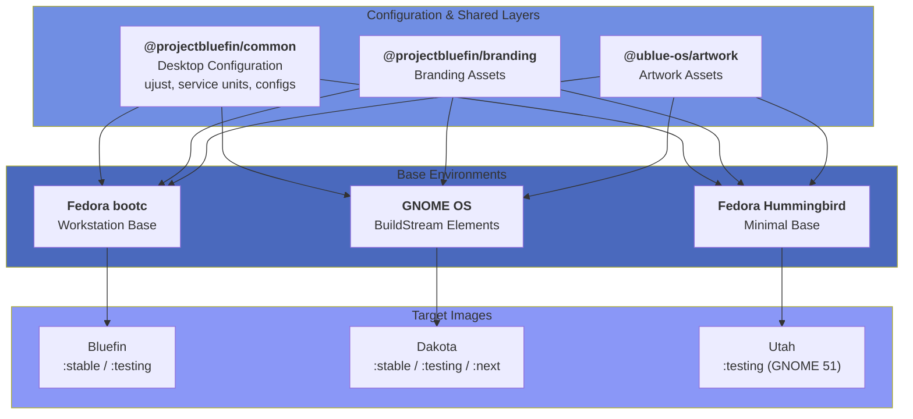

# Bluefin 기여자 안내

### [contribute.projectbluefin.io](https://contribute.projectbluefin.io)에 오신 것을 환영합니다

이 안내는 [Bluefin](https://projectbluefin.io)에 기여하는 방법에 대한 상세한 지시를 제공합니다. 버그 수정, 기능 추가, 문서 개선에 관계없이 이 안내는 Bluefin 팀이 확립한 워크플로우를 사용하여 효과적으로 기여하는 데 도움이 될 것입니다.

:::tip

당신은 당신의 운명에 기여하기 위해허락가 필요 없습니다.

-- Amber Graner

:::

## 시작하기

:::info 처음 기여하시나요?
작게 시작하세요! 문서 개선이나 간단한 추가가 훌륭한 첫 기여입니다. 이슈나 토론에서 질문하는 것을 주저하지 마세요.
:::

## Bluefin이 만들어지는 방법

Bluefin은 [lazy consensus](https://www.apache.org/foundation/glossary.html#LazyConsensus)를 통해 만들어집니다. 이는 우리가 "그냥 하세요" 방향으로 기울어진다는 의미입니다 — 너무 미치광이면 누군가가 무언가를 말할 것이기 때문입니다. 이것은 [Kubernetes](https://kubernetes.dev)에서 영감을 받은 우아한 오픈소스 방식입니다.

- [todo.projectbluefin.io](https://todo.projectbluefin.io/)를 확인하여 새로 있거나 진행 중인 작업을 확인하세요
- [Monthly Reports](/blog/tags/monthly-report)를 확인하여 최근에 완료된 작업을 확인하세요
- Draft의 항목은
  - 필요하지만 아직 청구되거나 명세되지 않은 것들
  - 또는 "기여자 안내 개선"이나 "이 just 레시피 손질"과 같이 많은 계획이 필요 없는 일시적인 것들입니다. 이들은 필요하다고 식별되었지만 많은 계획이 필요 없는 것들입니다 — "그냥 sysadmin을 보내세요" 스타일의 작업입니다.
- 설계를하고 명세하기 위해 Draft 작업을 이슈로 변환하세요
  - 설계와 명세는 프로젝 위한 것이며 구현 약속을 수반하지 않습니다.

### 아키텍처

Bluefin의 커스터마이징은 OCI 컨테이너에 보관되고, 이후 다른 컨테이너와base 이미지와 함께assemble되어 다른 Bluefin 이미지를 만듭니다.

전체 구성 요소 다이어그램과 assemble 흐름은 아래 [**Bluefin 아키텍처 이해**](#bluefin-아키텍처-이해)를 확인하세요.

### 시작하기 전에 알 것들

> 당신이 이것을 읽고 있다면, 당신은 Kubernetes nerd일 수도 있습니다. 당신은 Bluefin의 타겟 청중입니다. 환영합니다!

### Lazy Consensus 모델

Bluefin은 느슨한 [Apache Lazy Consensus](https://community.apache.org/committers/decisionMaking.html)를 따릅니다:

- 이의가 제기되지 않으면 consenus를 가정하세요
- 피드백에 시간을 허용하세요 (시간대/공휴일 고려)
- 의견 있는 결정 장려
- 피드백이 필요한 주요 변경에 대한 이슈를 게시하고 `enhancement`으로 태그하세요

Bluefin은 포식자이며 가끔 당신에게 물 수 있고, 이유 있는 의견 소유자입니다:

- userspace는 대부분 안정적입니다, 우리는 레이아웃에 대한_MAJOR_ 변경을 계획하지 않습니다 — 그냥 Ubuntu 데스크톱입니다.
- 우리의 **인프라 속도**는 인프라 작업에서 나옵니다
  - 이것이 프로젝트의 주요 초점입니다 — 최고의 인프라 없이는 제품을 전달할 수 없기 때문입니다. [bootc](https://github.com/bootc-dev/bootc)는 클라우드 네이티브 기술이며, 이유 때문에 우리가 그것 위에 구축하기를 선택합니다.
  - 당신이 "Kubernetes 플랫폼 팀의 Linux 사람"이라면 이것이 당신의 장소입니다
- 우리의 **제품 속도**는 workload에서 나옵니다
  - kickass GNOME 경험과 모든 최고의 upstream 기술을_ship하세요
  - premiere 클라우드 네이티브 개발자 경험을 전달하세요
  - 운영체제를 사용자로부터 추상화하세요
- 지속가능성은 프로젝트에 중요합니다
  - 때때로 무언가를 _하지_ 않는 것이 유지보수 부담보다 낫습니다
- 우리는 [no라고 말하기](https://mikemcquaid.com/saying-no/)를 선호합니다
  - 하지만 개인적으로 받아들이지 마세요, 우리는 매일 치즈버거를 먹을 수 없습니다, 어쩌면 장래에는. 그것이 당신을 여기로 가져왔습니다!

## 개요

Bluefin은 다른 이미지에_ship되는 설정 OCI 컨테이너의 조합입니다.

### Bluefin OCI 컨테이너

- Bluefin common: [@projectbluefin/common](https://github.com/projectbluefin/common) - Bluefin의 의견 대부분이 여기에 있습니다
  - ujust, motd, 서비스 유닛, GNOME 및 CLI 설정, 애플리케이션 선택 등. workload와 관련된 대부분의 것이 이 repo에 있습니다
- [@projectbluefin/branding](https://github.com/projectbluefin/branding) - 브랜딩과 시각적 자산
- [@ublue-os/artwork](https://github.com/ublue-os/artwork) - 공유 아트자산

### 이미지

- Bluefin: [@projectbluefin/bluefin](https://github.com/projectbluefin/bluefin) - Fedora 기반 워크스페이스 OCI 이미지
- Dakota: [@projectbluefin/dakota](https://github.com/projectbluefin/dakota) - GNOME OS / Apache BuildStream distroless 워크스페이스
- Utah: [@projectbluefin/utah](https://github.com/projectbluefin/utah) - GNOME 51 데스크톱 스택을 가진 Fedora Hummingbird
- Bluefin Server: [@projectbluefin/server](https://github.com/projectbluefin/server) - FSDK 기반 DDI 우선 서버 OS

:::info Distroless
이것은 전통적인 Linux 배포 모델의 반대입니다, 가치는 다른 OCI 레이어에 있습니다,base 이미지에만 있는 것이 아닙니다. 이것이 우리가 "배포는 중요하지 않다"라고 말할 때의 의미입니다 — 어떤base 이미지를든 사용할 수 있기 때문에 이것은 우리가 수행해야 할 결정의 긴 목록에서 또 다른 선택일 뿐입니다. 여전히 _중요합니다_, 중요하지 않을 뿐입니다. 그리고 어디서나 소프트웨어를 소스할 수 있기 때문에 "누가 더 좋은 소프트웨어를 가져오는가"라는 아이디어는 단지 그걸 자동화할 수 있을 때 큰 의미가 없습니다.
:::

## Bluefin 아키텍처 이해

다른 구성 요소는 다음 순서로 assemble됩니다. 이것은 GitHub Actions와 자동화된 워크플로우를 통해 수행됩니다:



### Image-Based Development

Bluefin은 OCI 컨테이너 이미지를 배포 메커니즘으로 사용합니다. repo에 대한 모든 커밋은 부팅 가능한 OS 이미지를 생성하는 빌드를 트리거합니다. 이 아키텍처는 다음과 같은 의미를 가집니다:

### 빌드 시스템

Bluefin 이미지는 다음을 사용하여 빌드됩니다:

- **Containerfile**:base 이미지 레이어와 빌드 인수를 정의합니다
- **빌드 스크립트**: `build_files/` 디렉토리에 위치하며 스테이지별로 조직됩니다
- **GitHub Actions**: `.github/workflows/`의 자동화된 워크플로우
- **Renovate Bot**: 자동화된 의존성 업데이트 (모든 커밋의 60%)

우리는 여기에서 bash와 약간의 Python으로 컨테이너를 만들고 있습니다, 우주선이 아닙니다.

### 릴리스 채널

| Channel    | Purpose       | Update Frequency | Fedora Version |
| ---------- | ------------- | ---------------- | -------------- |
| **latest** | Daily builds  | 하루에 여러 번   | 43 (current)   |
| **stable** | Weekly builds | 매주             | 43             |

### 필수 요건

**필수 지식:**

- Git 워크플로우 기본
- 컨테이너 개념 (Podman/Docker)
- Bash 스크립트 기본
- GitHub Actions 기본 (CI/CD 변경용)

**필수 도구:**

- git
- 텍스트 편집기 (VS Code, vim 등)
- 2FA가 활성화된 GitHub 계정
- 로컬 빌드를 위한 Podman 또는 Docker

**선택적이지만 권장됨:**

- Bluefin 설치 (테싱용)
- 커밋하기 전에 이슈와 문제를 이해함

### Fork 및 Clone

:::info[공장 및 애그젼틱 기여]
만약 당신이 `projectbluefin` repo의 핵심 애그젼틱 공장 팀의 일부로 기여한다면, 순수한 upstream 개발이 적용됩니다: 모든 기능 브랜치는 `origin`에 직접 생성되고 [Agentic Contributing](/agentic-contributing)의 게이트를 따릅니다. 직접 repo push 접근이 없는 외부 커뮤니티 기여자는 아래의 GitHub의 표준 fork-and-pull-request 워크플로우를 계속 사용해야 합니다.
:::

1. **repo를 포크하세요** GitHub에서 당신의 계정으로:

   ```bash
   # Navigate to https://github.com/projectbluefin/bluefin
   # Click "Fork" in the upper right
   ```

2. **당신의 포크를 clone하세요**:

   ```bash
   git clone https://github.com/YOUR_USERNAME/bluefin.git
   cd bluefin
   ```

3. **upstream remote를 추가하세요**:

   ```bash
   git remote add upstream https://github.com/projectbluefin/bluefin.git
   git fetch upstream
   ```

4. **설정 검증**:
   ```bash
   git remote -v
   # 다음을 보여줘야 합니다:
   # origin    https://github.com/YOUR_USERNAME/bluefin.git (fetch)
   # origin    https://github.com/YOUR_USERNAME/bluefin.git (push)
   # upstream  https://github.com/projectbluefin/bluefin.git (fetch)
   # upstream  https://github.com/projectbluefin/bluefin.git (push)
   ```

## 기여 워크플로우

### 작업 찾기

- **[pullrequests.projectbluefin.io](https://pullrequests.projectbluefin.io)** - Pull Request 검토는 항상 감사합니다. 병합 권한이 없어도 PR이 작동하고 테스트되었는지 검증하여 도울 수 있습니다.
- **[issues.projectbluefin.io](https://issues.projectbluefin.io)** - 이슈 참여와 트리어지는 항상 감사합니다!

#### 공통 기여 영역

- 🐛 **버그 수정**: `bug`로 라벨이 붙은 이슈
- 📦 **패키지 추가**: `enhancement`으로 라벨이 붙ened 이슈
- 📝 **문서**: `documentation`으로 라벨이 붙en 이슈
- 🔧 **빌드 개선**: `just` 또는 `github_actions`으로 라벨이 붙en 이슈
- 🎨 **개발자 기능**: `dx`으로 라벨이 붙en 이슈

### 브랜치 전략

1. **항상 main에서 브랜치하세요**:

   ```bash
   git checkout main
   git pull upstream main
   ```

2. **설명적인 기능 브랜치 생성**:

   ```bash
   # 버그 수정의 경우
   git checkout -b fix/cockpit-startup-crash

   # 기능의 경우
   git checkout -b feat/add-bazaar-integration

   # 문서의 경우
   git checkout -b docs/improve-local-build-guide

   # chores/유지의 경우
   git checkout -b chore/update-copr-repos
   ```

3. **브랜치 이름 규칙**:
   - `fix/`: 버그 수정
   - `feat/`: 새로운 기능
   - `docs/`: 문서 변경
   - `chore/`: 유지보수 작업
   - `refactor/`: 코드 리팩토링

### 변경 만들기

#### 파일 구조 개요

```
bluefin/
├── .github/
│   └── workflows/          # GitHub Actions CI/CD
│       ├── build-image-*.yml      # 이미지 빌드 워크플로우
│       ├── reusable-build.yml     # 공유 빌드 로직
│       └── clean.yml              # 정리 워크플로우
├── build_files/
│   ├── base/               # base 이미지 빌드 스크립트
│   ├── shared/             # 공유 유틸리티와 스크립트
│   └── dx/                 # 개발자 에디션 스크립트
├── system_files/
│   └── shared/             # 이미지에 복사되는 파일
├── flatpaks/               # Flatpak 앱 목록
├── just/                   # Just 레시피 (ujust 명령)
├── iso_files/              # ISO 특별 설정
├── packages.json           # 패키지 매니페스트
└── Containerfile           # 메인 이미지 정의
```

#### 공통 변경 유형

**1. 패키지 추가**

`packages.json`을 편집하세요:

```bash
vim packages.json
```

적절한 배열에 패키지를 추가하세요:

```json
{
  "all": {
    "include": {
      "rpm": ["existing-package", "your-new-package"]
    }
  }
}
```

**3. Just 레시피 추가**

`just/`에서 파일을 생성하거나 편집하세요:

```bash
vim just/60-custom.just
```

레시를 추가하세요:

```make
# Install custom development tool
install-custom-tool:
    #!/usr/bin/env bash
    set -euxo pipefail
    echo "Installing custom tool..."
    toolbox run sudo dnf install -y custom-tool
```

**4. 빌드 스크립트 수정**

빌드 스크립트는 실행 순서로 번호가 매겨집니다. 일반적인 스크립트:

- `04-packages.sh`: 패키지 설치
- `05-override-install.sh`: RPM 재정의
- `07-base-image-changes.sh`: 시스템 수정
- `17-cleanup.sh`: 정리 작업

항상 로컬 빌드로 변경을 테스트하세요 (테싱 섹션 참조).

**5. Flatpak 추가**

적절한 flatpak 목록 파일을 편집하세요:

```bash
# 모든 Bluefin 변형의 경우
edit flatpaks/bluefin-list.txt

# DX 변형에만
edit flatpaks/bluefin-dx-list.txt
```

Flatpak ID를 추가하세요 (한 줄에 하나):

```
com.example.NewApp
```

### 커밋 메시지 형식

:::caution 중요
Bluefin은 [Conventional Commits](https://www.conventionalcommits.org/)를 사용하며 CI가 강제합니다. 커밋 메시지가 이 형식을 따르지 않으면 PR이 실패합니다!
:::

**형식:**

```
<type>(<scope>): <subject>

<body>

<footer>
```

**유형:**

- `feat`: 새로운 기능
- `fix`: 버그 수정
- `docs`: 문서 변경
- `chore`: 유지보수 작업
- `refactor`: 코드 리팩토링
- `test`: 테스트 추가/변경
- `style`: 코드 스타일 변경
- `perf`: 성능 개선

**실제 Bluefin 커밋에서의 예제:**

```bash
# 간단한 수정
git commit -m "fix: remove cockpit and brew setup functions"

# 기능 추가
git commit -m "feat: add bazaar flatpak to default installation"

# scope를 가진 chores
git commit -m "chore(deps): update ghcr.io/projectbluefin/common digest to 9168d7d"

# 문서
git commit -m "docs: explain hat wobble"

# 설명이 있는 여러 줄
git commit -m "fix: Remove unused terminal and VFIO configurations

These configurations were causing conflicts with default GNOME settings
and are no longer needed with the updated kernel modules."
```

**커밋 메시지 팁:**

- 제목을 72자 아래로 유지하세요
- 명령형을 사용하세요 ("added"나 "adds" 대신 "add")
- 제목을 마침표로 끝내지 마세요
- 복잡한 변경에 대해 본문에서 맥락을 제공하세요
- `Fixes #123` 또는 `Closes #456`로 이슈를 참조하세요

### AI 에이전트 귀속

AI 에이전트는 커밋 footer에 "Assisted-by" trailer로 사용한 도구와 모델을 공개해야 합니다. Bluefin repo에서 사용되는 `AGENTS.md`는 당신의 에이전트에 이 정책을 강제하도록 지시할 것입니다:

```
Assisted-by: [Model Name] via [Tool Name]
```

예제:

```text
Assisted-by: Claude 4.5 Opus via GitHub Copilot
```

### 커밋 만들기

```bash
# 변경을 staging하세요
git add path/to/modified/file.sh

# 또는 모든 변경을 staging하세요
git add .

# 커밋할 내용을 검토하세요
git diff --cached

# 메시지로 커밋하세요
git commit -m "feat(just): add custom development tool installer"

# 또는 여러 줄 커밋을 위해 편집기를 사용하세요
git commit
```

### 변경 푸시

```bash
# 당신의 크로 푸시하세요
git push origin feat/add-bazaar-integration

# Amend 후에 force push가 필요한 경우 (주의하여 사용)
git push origin feat/add-bazaar-integration --force-with-lease
```

## 변경 테스트

:::tip 테스트가 핵심입니다
병합하기 전에 항상 로컬에서 또는 PR 빌드를 통해 변경을 테스트하세요. 깨진 빌드는 모두에게 영향을 줍니다!
:::

### 로컬 빌드 테스트

**옵션 1: 컨테이너 빌드**

```bash
# just로 로컬에서 빌드
just build

# 또는 직접 podman으로 빌드
podman build -t bluefin-test:latest .
```

**옵션 2: GitHub Actions 빌드** (PR 빌드를 사용하세요)

PR을 열면 GitHub Actions는 자동으로 당신의 변경을 빌드합니다. 다음을 위해 Actions 탭을 확인하세요:

- 빌드 로그
- 성공/실패 상태
- 빌드 아티팩트

### 당신의 시스템에서 테스트

:::warning 당신의 시스템에서 테스트
Rebase는 강력하지만 위험을 수반합니다. 항상 stable로 되돌릴 백업 계획을 가지세요!
:::

**PR 이미지를 사용하세요:**

모든 PR은 테스트 이미지를 생성합니다. 당신은 그에게 rebase할 수 있습니다:

```bash
# PR 번호 찾기 (예: #3322)
# PR 이미지에 rebase하세요
sudo bootc switch ghcr.io/projectbluefin/bluefin:pr-3322

# 테스트하기 위해 재부팅하세요
sudo systemctl reboot

# 작동하면, PR에 피드백을 남겨세요
# 작동하지 않으면, stable로 되돌리세요
sudo bootc switch ghcr.io/projectbluefin/bluefin:stable
sudo systemctl reboot
```

**Just 레시피 테스트:**

```bash
# 사용 가능한 레시피 나열하세요
ujust

# 새로운 레시피 테스트하세요
ujust install-custom-tool

# 출력에서 에러를 확인하세요
```

### 린팅 및 검증

**스크립트 린팅:**

```bash
# 설치되어 있지 않으면 shellcheck를 설치하세요
brew install shellcheck

# 스크립트 린팅하세요
shellcheck build_files/base/*.sh
```

**컨테이너 린팅:**

```bash
# Containerfile에 hadolint를 사용하세요
podman run --rm -i hadolint/hadolint < Containerfile
```

**JSON 검증:**

```bash
# packages.json을 검증하세요
jq empty packages.json && echo "Valid JSON" || echo "Invalid JSON"
```

## Pull Request 열기

### Pre-PR 체크리스트

- [ ] 코드가 repo의 기존 패턴을 따릅니다
- [ ] 커밋 메시지가 Conventional Commits 형식을 사용합니다
- [ ] 변경이 테스트되었습니다 (로컬에서 또는 영향 이해를 통해)
- [ ] 필요한 경우 문서가 업데이트되었습니다
- [ ] 관련 없는 변경이 포함되어 있지 않습니다
- [ ] 브랜치가 upstream main과 최신입니다

### PR 생성

1. **브랜치를 시키세요** (이미 하지 않았다면):

   ```bash
   git push origin your-branch-name
   ```

2. **GitHub에서 PR을 열세요**:
   - <https://github.com/projectbluefin/bluefin>으로 이동하세요
   - "Pull requests" → "New pull request"을 클릭하세요
   - "compare across forks"을 클릭하세요
   - 당신의 크로와 브랜치를 선택하세요
   - "Create pull request"을 클릭하세요

3. **PR 설명을 작성하세요**:

```markdown
## Description

Brief description of what this PR does.

## Type of Change

- [ ] Bug fix
- [ ] New feature
- [ ] Documentation update
- [ ] Code refactoring
- [ ] Build/CI improvement

## Testing Done

- Local build: Yes/No
- Tested on running system: Yes/No
- Just recipes tested: Yes/No

## Related Issues

Fixes #123
```

### PR 검토 과정

**다음에는 무엇이 일어나나요:**

1. **자동화된 검사가 실행됩니다**: CI가 당신의 변경을 빌드합니다
2. **크기 라벨이 적용됩니다**: PR 크기가 자동으로 라벨이 붙습니다 (XS, S, M, L, XL)
3. **메인테이너 검토**: 보통 24-48시간 이내
4. **피드백 처리**: 요청되면 변경하세요
5. **승인과 병합**: 승인되면, 메인테이너가 병합합니다. 반복하세요!

**검토 동안:**

변경이 요청되면:

```bash
# 요청된 변경을 하세요
vim path/to/file

# 변경을 커밋하세요
git add path/to/file
git commit -m "fix: address review feedback on error handling"

# PR을 업데이트하기 위해 푸시하세요
git push origin your-branch-name
```

**병합 후:**

```bash
# main으로 돌아가세요
git checkout main

# 최신 변경을_pull하세요
git pull upstream main

# 당신의 크로를 업데이트하세요
git push origin main

# 기능 브랜치를 삭제하세요
git branch -d your-branch-name
git push origin --delete your-branch-name
```

## 고급 워크플로우

:::note 고급 Techniques
이러한 워크플로우는 더 많은 경험 있는 기여자를 위한 것입니다. 새 기여자는 먼저 기본에 집중해야 합니다!
:::

### Renovate Bot와 함께 작업하기

우리는 가능한 많은 것을 자동화하기를 노력하며, 이는 기계가 웅웅거리는 것을 주시하며 게으르게 시간을 소비한다는 의미입니다. Renovate는 30분마다 실행되며, upstream Universal Blue에서 변경이 있으면 모든 것이 재빌드됩니다. 병합된 수정이나 기능이 라이브가 되기까지 약 30분에서 2시간이 걸립니다. 수정이 필요한 곳에 따라 다릅니다.

**Renovate 이해:**

- Renovate는 의존성 업데이트에 대한 PR을 자동으로 생성합니다
- 업데이트에는 포함됩니다:base 이미지, GitHub Actions, 컨테이너 다이제스트
- 낮은 위험 업데이트에 대해 자동 병합이 활성화됩니다
- 모든 커밋의 60%를 차지합니다

**일반적인 Renovate PR:**

```
chore(deps): update ghcr.io/projectbluefin/common digest to abc123
chore(deps): update softprops/action-gh-release digest to def456
```

**Renovate가 당신의 PR과 충돌할 때:**

```bash
# 최신 main에서 rebase하세요
git checkout your-branch
git fetch upstream
git rebase upstream/main

# 충돌을 해결하세요 (있는 경우)
git mergetool  # 또는 수동으로 파일 편집

# rebase를 계속하세요
git rebase --continue

# force push (당신의 PR, 당신의 브랜치)
git push origin your-branch --force-with-lease
```

### 멀티 커밋 PR

더 큰 기능을 위해:

```bash
# 작업하는 동안 논리적 커밋을 생성하세요
git add file1.sh
git commit -m "feat: add base functionality"

git add file2.sh
git commit -m "feat: add error handling"

git add file3.sh
git commit -m "docs: document new feature"

# 모든 커밋을 시키세요
git push origin your-branch
```

### 커밋 Amend

```bash
# 추가 변경을 staging하세요
git add forgotten-file.sh

# 마지막 커밋을 amend하세요
git commit --amend

# 또는 메시지를 변경하지 amend하세요
git commit --amend --no-edit

# 안전성으로 force push하세요
git push origin your-branch --force-with-lease
```

### Cherry-Picking 변경

```bash
# 다른 브랜치에서 커밋을 cherry-pick하세요
git cherry-pick abc123def

# 여러 커밋을 cherry-pick하세요
git cherry-pick abc123..def456

# 필요한 경우 충돌을 해결하세요
git cherry-pick --continue
```

### upstream 변경과 함께 작업하기

```bash
# 정기적으로 upstream 변경을 가져오세요
git fetch upstream

# main 브랜치를 업데이트하세요
git checkout main
git merge upstream/main

# 기능 브랜치를 rebase하세요
git checkout your-feature
git rebase main

# 또는 main을 기능에 병합하세요
git merge main
```

## 전문성에 따른 기여 영역

:::info 당신의 적합도를 찾으세요
기여자들은 다양한 배경에서 옵니다. 당신이 DevOps 엔지니어나 아티스트, 취미생활자, homelabber, 또는 문서 작가든, Bluefin에서 당신의 기술을 사용할 장소가 있습니다!
:::

### 클라우드 네이티브/DevOps 엔지니어를 위해

**컨테이너 빌드 최적화:**

- Containerfile 레이어 캐싱 개선
- 속도를 위한 빌드 스크립트 최적화
- 이미지 크기 축소

**CI/CD 개선:**

- GitHub Actions 워크플로우 최적화
- 빌드 병렬화 추가
- 아티팩트 처리 개선
- Cloudflare 전문가 항상 감사합니다!

### 메인테이너를 위해

**UDEV 규칙:**

- 하드웨어 엔블먼트 규칙 제출
- 다양한 하드웨어에서 테스트
- 하드웨어 문서 작성

### 스크립트 개발자를 위해

**빌드 스크립트 개선:**

- 에러 처리 향상
- 진행 표시 추가
- 스크립트 모듈성 개선
- nice CLI 사용자 경험을 위해 `gum`, `glow`를 더 많이 사용

**Just 레시피 개발:**

- ujust 명령 유지
- 기존 레시피 개선
- 사용자 친화적 alias 추가 등

### 문서 작가를 위해

**문서 표준:**

- 명확하고 간결한 언어 사용
- "simply" 또는 "easy" 같은 용어 회피 ([justsimply.dev](https://justsimply.dev/))
- 실용적인 예제 포함
- 관련 문서로 링크

### 프론트엔드/UX 개발자를 위해

-위로 작업하세요!

## 문제 해결 가이드

:::tip 일반적인 문제 및 해결책
막혔나요? 먼저 이 섹션을 확인하세요. 대부분의 문제는 이전에 겪었고 알려진 해결책이 있습니다!
:::

### 빌드 실패

**문제:** 패키지가 충돌하여 빌드가 실패합니다

```
Error: package foo conflicts with bar
```

**해결책:**

1. 패키지가 이미 다른 곳에서 포함되어 있는지 확인하세요
2. packages.json에 배제를 추가하세요
3. COPR 레포지토리 호환성을 확인하세요

**문제:** 빌드 중 Git 에러

```
fatal: unable to access 'https://github.com/': Could not resolve host
```

**해결책:**

1. 빌드 환경에서 네트워크 연결을 확인하세요
2. GitHub Actions에 네트워크 접근이 있는지 확인하세요
3. GitHub에 의해 rate-limited인지 확인하세요

### 로컬 테스트 문제

**문제:** 권한 에러로 Podman 빌드가 실패합니다

```
Error: writing blob: adding layer with blob: permissions denied
```

**해결책:**

```bash
# 적절한 권한으로 실행하세요
sudo podman build -t test .

# 또는 rootless podman을 구성하세요
podman system migrate
```

**문제:** 빌드 중 디스크 공간 부족

```
Error: no space left on device
```

**해결책:**

```bash
# podman 저장소를 정리하세요
podman system prune -a

# 디스크 공간을 확인하세요
df -h
```

### PR 문제

**문제:** CI 검사 실패 - Conventional Commit 검증

```
❌ Commit message does not follow Conventional Commits format
```

**해결책:**

```bash
# 커밋 메시지를 amend하세요
git commit --amend

# PR을 업데이트하세요
git push origin your-branch --force-with-lease
```

**문제:** main과의 병합 충돌

```
CONFLICT (content): Merge conflict in packages.json
```

**해결책:**

```bash
# 최신 upstream을 가져오세요
git fetch upstream

# main에서 rebase하세요
git rebase upstream/main

# 충돌을 수동으로 해결하세요
vim packages.json

# 해결된 것으로 표시하세요
git add packages.json
git rebase --continue

# force push하세요
git push origin your-branch --force-with-lease
```

## 커뮤니티 상호작용

### 통신 채널

**GitHub 이슈:**

- 버그 보고와 기능 요청의 주요 장소
- 사용 가능한 경우 이슈 템플릿 사용
- 새로운 것을 생성하기 전에 기존 이슈를 검색하세요

**Discord:**

- 빠른 질문을 위한 실시간 채팅
- [Bluefin Discord](https://discord.gg/XUC8cANVHy)에 참여하세요
- **기억하세요:** Discord는 채팅을 위한 것이지 영구 문서가 아닙니다

**토론 포럼:**

- [community.projectbluefin.io](https://community.projectbluefin.io/)
- 긴 형식의 토론
- 지원 질문
- 커뮤니티 피드백

### 소통 최선의 방법

**할 것:**

- ✅ 영구 기록을 위해 이슈에서 질문하세요
- ✅ 묻기 전에 검색하세요
- ✅ 맥락과 세부사항을 제공하세요
- ✅ 메인테이너 응답 시간에 인내하세요
- ✅ 도움이 될 때 다른 사람을 도와세요
- ✅ 기여자에게 감사하세요

**하지 마세요:**

- ❌ 버그 보고를 위해 Discord를 사용하지 마세요 (대신 이슈를 제기하세요)
- ❺ 즉각적인 응답을 기대하지 마세요
- ❺ 급하지 않은 경우 메인테이너를 직접 호출하지 마세요
- ❺ 여러 채널에서 같은 질문을 하지 마세요
- ❺ 추가 정보 없이 "me too" 댓글을 게시하지 마세요

### 행동 강령

모든 기여자는 [Bluefin 행동 강령](/code-of-conduct)을 따라야 합니다.

**핵심 포인트:**

- 존중하고 포용적이세요
- 새 사람들을 환영하세요
- 건설적인 피드백에 집중하세요
- 부절차한 행동을 `jorge.castro@gmail.com`으로 보고하세요

### 이슈 캡치 디시플린

:::note 이슈 캡치 철학
빠른 디버깅을 위해 Discord를 사용하지만, 항상 해결책을 GitHub 이슈에 캡치하세요. 이것은 커뮤니티를 위한 영구적이고 검색 가능한 지식을 구축합니다.
:::

기여자 안내 철학에서:

**"캡치" 패턴:**

1. **빠른 반복을 위해 Discord를 사용하세요** - 채팅에서 빠르게 디버깅하세요
2. **텍스트 편집기에 캡치하세요** - 중요한 발견을 가는 대로 복사하세요
3. **이슈를 제기하세요** - 해결해결책의의 영구 기록을 생성하세요
4. **편집하고 개선하세요** - 나중에 이슈 설명을 정리하세요

**이것이 중요한 이유:**

- 모두를 위해 한 번 문제를 해결합니다
- 검색 가능한 문서를 구축합니다
- 같은 질문을 두 번 하지 않습니다
- 기관 지식을 구축합니다

**예제 흐름:**

```
Discord: "Hey, package X is failing to install"
  ↓ (quick back-and-forth debugging)
  ↓ (copy findings to text editor)
  ↓
GitHub Issue: "Package X fails on Fedora 42 due to Y dependency"
  - Symptoms
  - Root cause
  - Solution
  - Related links
```

## 인프라 기여

### GitHub Actions 워크플로우

**워크플로우 구조:**

- `build-image-*.yml`: 채널별 빌드 트리거
- `reusable-build.yml`: 공유 빌드 로직
- `clean.yml`: 아티팩트 정리
- `generate-release.yml`: 릴리스 노트

**워크플로우 변경 만들기:**

```bash
# 워크플로우 파일 편집하세요
vim .github/workflows/build-image-stable.yml

# 로컬에서 구문을 검증하세요
# GitHub의 워크플로우 검증기 또는:
yamllint .github/workflows/build-image-stable.yml

# 커밋하세요
git add .github/workflows/build-image-stable.yml
git commit -m "chore(ci): improve stable build caching"

# 먼저 당신의 크로에서 테스트하세요
git push origin your-branch
# PR을 열어서 작동하는지 확인하세요
```

**일반적인 워크플로우 패턴:**

```yaml
# 조건부 실행
- name: Build only on main
  if: github.ref == 'refs/heads/main'
  run: ./build.sh

# 매트릭스 빌드
strategy:
  matrix:
    variant: [bluefin, bluefin-dx]
    fedora: [42, 43]
```

### 스크립트 개발

**스크립트 조직:**

- `00-09`: 초기 스테이지 (kernel, repos, packages)
- `10-16`: 중간 스테이지 (설정, 추가)
- `17-19`: 후기 스테이지 (정리, initramfs)

**스크립트 템플릿:**

```bash
#!/usr/bin/bash
set -eoux pipefail

echo "::group:: Your Script Name"

# 당신의 로직 여기를
# Use $FEDORA_MAJOR_VERSION for version-specific logic
# Use $IMAGE_NAME for image-specific logic

echo "::endgroup::"
```

**스크립트 테스트:**

```bash
# 직접 실행 (간단한 스크립트의 경우)
bash -x build_files/base/04-packages.sh

# 컨테이너 실행 (base 이미지 내에서 테스트)
podman run --rm -it \
  -v "$(pwd):/workspace:ro" \
  ghcr.io/projectbluefin/bluefin:testing \
  bash /workspace/build_files/base/04-packages.sh
```

## 릴리스 과정

### 릴리스 이해

Bluefin은 지속적인 전달을 사용합니다:

- **Daily builds**: 자동적, 수동 릴리스 없음
- **형식**: `42.20251012.1` (Fedora.YYYYMMDD.build)
- **하루에 여러 빌드**: 다양한 채널이 독립적으로 업데이트됩니다

### 릴리스 채널

**stable:**

```bash
# stable로 rebase하세요
sudo bootc switch ghcr.io/projectbluefin/bluefin:stable
```

**testing:**

```bash
# testing로 rebase하세요
sudo bootc switch ghcr.io/projectbluefin/bluefin:testing
```

## 패키지 버전 고정

:::caution 임시 우회책만
패키지 고정은 upstream regressions에 대한 임시 우회책입니다. 항상 그들이 왜 존재하는지 문서화하고 수정이 출시된 후 제거하세요!
:::

때때로upstream Fedora는 임시 고정이 필요한 regressions을 가집니다.

**고정 추가:**

적절한 Containerfile 섹션을 편집하세요:

```dockerfile
# Revert to older version of ostree to fix Flatpak installations
RUN rpm-ostree override replace \
    https://bodhi.fedoraproject.org/updates/FEDORA-2023-cab8a89753
```

**고정 문서화:**

```bash
# 설명하는 주석을 추가하세요:
# - 무엇이 고정되어 있는지
# - 왜 고정되어 있는지
# - upstream 버그로의 링크
# - 제거할 때 (수정이 출시된 후)
```

**고정 제거:**

Fedora가 수정을 출시한 후 24-48시간을 기다리세요 (재빌드 전파를 위해), 그런 다음:

```bash
# 재정제를 제거하세요
git diff Containerfile
# 고정이 제거되어 있는지 확인하세요
git commit -m "chore: remove ostree pin after upstream fix"
```

## Bluefin에서의 Flatpak 관리

### 1.Flathub에서 얻은 Flatpak

Bluefin은 자체 Flatpak 레포지토리를 호스트하지 않습니다. 모든 그래픽 애플리케이션은 먼저 [Flathub](https://flathub.org/)에 게시되어야 합니다. 새 Flatpak을 기여하려면:

- 애플리케이션이 [Flathub의 기술적, 법적 요구사항](https://docs.flathub.org/docs/for-app-authors/requirements)을 충족하는지 확인하세요.
- Flatpak 매니페스트를 준비하고 `flatpak-builder`를 사용하여 로컬 빌드를 테스트하세요.
- [flathub/flathub](https://github.com/flathub/flathub) repo를 fork하고, 새 브랜치를 만들고, 매니페스트와 필요한 파일을 추가하고, `new-pr` 브랜치에 대해 PR을 열어 Flathub에 애플리케이션을 제출하세요. [제출 가이드](https://docs.flathub.org/docs/for-app-authors/submission)를 따르세요.
- 검토자의 피드백에 답하고 필요한 경우 반복하세요. 승인되면, 애플리케이션은 Flathub에 게시되고 Bluefin 사용자에게 사용 가능합니다.

### 2. Flatpak 품질 및 유지보수

[Flathub의 유지보수 지침](https://docs.flathub.org/docs/for-app-authors/maintenance)을 따라 Flatpak을 유지하세요. 여기에는 런타임 업데이트, 빌드 실패에 대한 답변, 메타데이터 품질 보장이 포함됩니다. 모든 품질 검사를 통과하는 애플리케이션은 Flathub와 Bazaar와 같은 downstream 큐레이드 스토어 모두에서 다룰 가능성이 더 높습니다.

## Bluefin에서 시스템 Flatpaks 관리

Bluefin의 시스템 전체 Flatpaks는 기본적으로 설치될 Flatpak 애플리케이션 ID를 나열하는 설정 파일을 통해 관리됩니다. 이러한 파일은 다음과 같습니다:

- 표준 시스템 Flatpaks에 대한 `/etc/ublue-os/system-flatpaks.list`
- 개발자 모드 Flatpaks에 대한 `/etc/ublue-os/system-flatpaks-dx.list`

변경을 제안하기 위해 (추가, 업데이트, 또는 제거):

1. Bluefin repo에서 관련 목록 파일을 편집하고 (`flatpaks/system-flatpaks.list` 또는 `flatpaks/system-flatpaks-dx.list`) 필요에 따라 Flatpak ID를 추가하거나 제거하세요. 각 줄은 하나의 Flatpak 앱 ID를 포함해야 합니다. 예를 들면:
   ```
   app/org.mozilla.firefox
   app/org.gnome.Calculator
   ```
2. 변경이 있는 PR을 제출하세요. 메인테이너가 적절히 검토하고 병합합니다.

시스템 프로비저닝 또는 업데이트 동안, Bluefin은 다음 로직을 사용하여 이러한 파일에 나열된 모든 Flatpaks를 설치하거나 업데이트합니다:

```bash
flatpak remote-add --if-not-exists --system flathub https://flathub.org/repo/flathub.flatpakrepo
xargs flatpak --system -y install --or-update < /etc/ublue-os/system-flatpaks.list
# 개발자 모드 Flatpaks는 개발자모드가 활성화되어 설치됩니다
xargs flatpak --system -y install --or-update < /etc/ublue-os/system-flatpaks-dx.list
```

[참조](https://github.com/projectbluefin/bluefin/blob/3ddc76eaf5536f7340e34b2242131c2f7a455bd1/just/bluefin-system.just)

## Bazaar에서 Flatpak 소개

Bazaar의 소개 섹션은 YAML 설정 파일에 정의됩니다:
`system_files/shared/usr/share/ublue-os/bazaar/config.yaml`

각 섹션 (예: "Bluefin Recommends", "Browsers", "Media")는 그 섹션에 나타날 Flatpaks를 지정하는 `appids` 목록을 포함합니다. Flatpak을 소개하려면:

1. Flatpak이 Flathub에서 사용 가능하고 Bazaar 차단 목록 (`system_files/shared/usr/share/ublue-os/bazaar/blocklist.txt`)에 없는지 확인하세요.
2. `config.yaml`을 편집하고 Flatpak의 앱 ID를 원하는 섹션의 `appids` 목록에 추가하세요. 예를 들면:
   ```yaml
   sections:
     - title: "Bluefin Recommends"
       appids:
         - org.mozilla.firefox
         - org.gnome.Calculator
         - com.example.YourApp # <-- 여기에 앱을 추가하세요
   ```
3. 선택적으로, 애플리케이션이 새 카테고리에 맞으면 새 섹션을 생성하세요.
4. 변경이 있는 PR을 제출하세요. Bazaar 메인테이너가 적절히 검토하고 병합합니다.

[참조](https://github.com/projectbluefin/bluefin/blob/3ddc76eaf5536f7340e34b2242131c2f7a455bd1/system_files/shared/usr/share/ublue-os/bazaar/config.yaml)

## 수명 관리

### 업데이트

- Flatpaks는 Flathub에서 자동으로 업데이트됩니다. 새 버전이 Flathub에 게시되면, Bluefin 시스템은 다음 시스템 Flatpak 업데이트 주기에서 업데이트를 받게 됩니다.
- Flatpak의 버전을 업데이트하려면, Flathub에서 업데이트하세요. 앱 ID가 변경되거나 앱이 제거되지 않는 한 Bluefin에서 변경이 필요 없습니다.

### 제거

- Bluefin의 기본 설치에서 Flatpak을 제거하려면, 관련 시스템 Flatpak 목록 파일과/또는 Bazaar의 `config.yaml`에서 그 항목을 삭제하세요.
- Flathub에서 Flatpak을 제거하려면, [Flathub의 수명 종료 과정](https://docs.flathub.org/docs/for-app-authors/maintenance#end-of-life)을 따르세요.

### 차단 목록화

- 일부 Flatpaks는 `blocklist.txt` 파일을 통해 Bazaar에서 명시적으로 배제됩니다. 차단된 앱 ID를 Bazaar의 소개 섹션에 추가하지 마세요.

### 유지보수 책임

- Flatpak 메인테이너는 Flathub에서 애플리케이션을 최신 상태로 유지할 책임이 있습니다.
- Bluefin 메인테이너는 시스템 Flatpak 목록과 Bazaar 설정에 대한 변경을 검토하고 병합합니다.

## Fedoraupstream 보고

### 언제upstream으로 보고할까

다음과 같은 버그를 찾으면:

- vanilla Fedora Atomic Desktops에 존재하는
- Bluefin 수정으로 인해 발생하지 않는
- base Fedora 시스템에 영향을 받는

###upstream으로 보고하는 방법

1. **upstream Fedora에서 재현하세요** (가능하면):

   ```bash
   # 이슈가 upstream Fedora Atomic / bootc에서 발생하는지 테스트하세요
   ```

2. **Fedora로 보고하세요**:
   -upstream 추적자: [Fedora Atomic Desktops Issue Tracker](https://forge.fedoraproject.org/atomic-desktops/tracker/issues)
   - 포함하세요: Fedora 버전, 재현 단계, 로그

3. **Bluefin 이슈에서 링크하세요**:
   - upstream 이슈를_cross-참조하세요
   - upstream 진행을 추적하세요
   - 수정을 테스트하세요

## 메인테이너 노트

### 메인테이너 되기

정기적으로 기여하고 전문성을 보여주면 메인테이너 상태에 이를 수 있습니다. 가치 있는 품질:

- 일관된 품질 기여
- 좋은 통신
- 다른 기여자에게 도움
- 프로젝트 목표 이해
- 신뢰할 수 있고 응답적

**현재 메인테이너 구조:**

- [현재 팀](https://github.com/orgs/projectbluefin/people)

## 추가 자원

### 문서

- [Bluefin 문서](https://docs.projectbluefin.io/)
- [애그젼틱 기여자 안내](/agentic-contributing)
- [Universal Blue](https://universal-blue.org/)
- [bootc 문서](https://bootc.dev/bootc/)

### 도구

- [Conventional Commits](https://www.conventionalcommits.org/)
- [Just Command Runner](https://github.com/casey/just)
- [Podman 문서](https://docs.podman.io/)
- [GitHub Actions 문서](https://docs.github.com/en/actions)

프로젝트는 모든 기술 수준과 기여 유형을 환영합니다. 작게 시작하고, 워크플로우를 배우며, 시간이 지남에 참여를 확장하세요.

## 마무리 팁

:::tip Bluefin에 오신 것을 환영합니다!
모든 메인테이너는 첫 기여자로서 시작했습니다. 한 번에 한 걸음을 내딛고, 질문하는 것을 두려워하지 마세요!
:::

1. **작게 시작하세요**: 문서 또는 간단한 수정과 추가에서 시작하세요
2. **질문하세요**: 확인을 위해 질문하는 것을 주저하지 마세요
3. **철저히 테스트하세요**: 로컬 빌드 또는 PR 이미지를 사용하세요
4. **인내하세요**: 검토에는 시간이 걸립니다. 메인테이너는 여러 우선순위를 균형 있게 처리합니다
5. **다른 사람으로부터 배우세요**: 병합된 PR을 읽어 패턴을 이해하세요
6. **규칙을 따르세요**: 코드베이스의 확립된 패턴을 유지하세요
7. **당신의 작업을 문서화하세요**: 명확한 설명으로 미래의 기여자를 도와하세요

기억하세요: 모든 메인테이너는 첫 기여자로서 시작했습니다. Bluefin 커뮤니티에 오신 것을 환영합니다!
