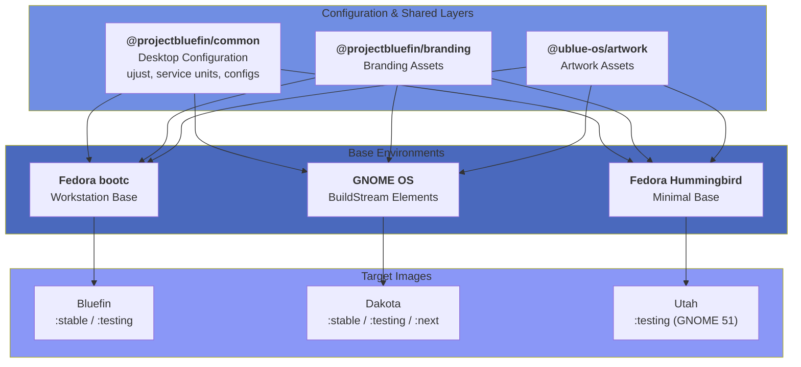

# Bluefin 贡献者指南

### 欢迎加入 [contribute.projectbluefin.io](https://contribute.projectbluefin.io)

本指南为向 [Bluefin](https://projectbluefin.io) 做出贡献提供详细说明。无论你是修复 bug、添加功能还是改进文档，本都会帮助你使用 Bluefin 团队确立的工作流有效地做出贡献。

:::tip

你不需要获得对自己命运的许可。

-- Amber Graner

:::

## 入门

:::info 首次贡献？
从小事做起！文档改进或简单添加都是很好的首次贡献。不要在 issue 或讨论中犹豫提问。
:::

## Bluefin 是如何制造的

Bluefin 通过[lazy consensus（惰性共识）](https://www.apache.org/foundation/glossary.html#LazyConsensus)来制作，这意味着我们倾向于"直接做"，因为如果太疯狂会有人提意见。这是一种很随性的开源方式，并受到[Kubernetes](https://kubernetes.dev)的启发。

- 查看 [todo.projectbluefin.io](https://todo.projectbluefin.io/) 来查看新增或进行中的工作
- 查看 [Monthly Reports（月度报告）](/blog/tags/monthly-report) 来查看最近完成的工作
- Draft（草稿）中的项目是
  - 需要发生但尚未认领或未详细说明的事情
  - 或是无需太多规划的事情，比如"改进贡献者指南"或"修好这个 just recipe"。这些是被识别为需要但不需太多规划的事情，"just send a sysadmin"（直接派个系统管理员）式任务。
- 把 Draft 任务转换为 issue 来设计和详细说明某件事
  - 设计和说明是为了项目的好处，且不附带实现承诺。

### 架构

Bluefin 的定制保存在 OCI 容器中，然后与其他容器和基础镜像组装在一起，创建不同的 Bluefin 镜像。

完整组件图和组装流程见下面的[**理解 Bluefin 的架构**](#understanding-bluefins-architecture)。

### 在深入之前要知道的事情

> 如果你正在阅读这个，那么你可能也是个 Kubernetes 极客。你就是 Bluefin 的目标受众。欢迎！

### Lazy Consensus 模型

Bluefin 遵循宽松的 [Apache Lazy Consensus](https://community.apache.org/committers/decisionMaking.html)：

- 除非提出异议，否则假设达成共识
- 留出反馈时间（考虑时区/节假日）
- 鼓励有主见的决策
- 针对需要反馈的重大变化发布 issue，并用 `enhancement` 标签标记它们

Bluefin 是捕食者，偶尔会咬你一下，并且有主见是有原因的：

- 用户空间大多是稳定的，我们不打算对布局做重大改变——它就是那个 Ubuntu 桌面。
- 我们的**基础设施速度**来自基础设施工作
  - 这是项目的主要焦点，因为没有最好的基础设施就无法交付产品，[bootc](https://github.com/bootc-dev/bootc) 是云原生技术，我们选择在其上构建是有原因的。
  - 如果你是"Kubernetes 平台团队上的 Linux 那个人"，这里就是你的归宿
- 我们的**产品速度**来自工作负载
  - 交付一个超赞的 GNOME 体验和所有最好的上游技术
  - 交付一流的云原生开发者体验
  - 把操作系统从用户面前抽象出去
- 可持续性对这个项目至关重要
  - 有时候不交付某样东西比维护负担更好
- 我们倾向于[说"不"](https://mikemcquaid.com/saying-no/)
  - 但别往心里去，我们不能天天吃芝士汉堡，也许有一天会。那正是把你带到这里的东西！

## 概览

Bluefin 是一组配置 OCI 容器的组合，然后被送到不同的镜像上。

### Bluefin OCI 容器

- Bluefin common: [@projectbluefin/common](https://github.com/projectbluefin/common) - Bluefin 的大部分主见都在这里
  - ujust、motd、service units、GNOME 和 CLI 配置、应用选择等。绝大多数与工作负载有关的东西都在这个仓库里
- [@projectbluefin/branding](https://github.com/projectbluefin/branding) - 品牌与视觉资产
- [@ublue-os/artwork](https://github.com/ublue-os/artwork) - 共享的艺术资产

### 镜像

- Bluefin: [@projectbluefin/bluefin](https://github.com/projectbluefin/bluefin) - 基于 Fedora 的工作站 OCI 镜像
- Dakota: [@projectbluefin/dakota](https://github.com/projectbluefin/dakota) - GNOME OS / Apache BuildStream distroless 工作站
- Utah: [@projectbluefin/utah](https://github.com/projectbluefin/utah) - 带 GNOME 51 桌面栈的 Fedora Hummingbird
- Bluefin Server: [@projectbluefin/server](https://github.com/projectbluefin/server) - 基于 FSDK 的 DDI-first 服务器操作系统

:::info Distroless（发行版无关）
这与传统的 Linux 发行版模型相反，价值在其他 OCI 层，而不在基础镜像。这就是我们说的"发行版不重要"的意思，因为你可以使用任何基础镜像，它只是我们要做的众多决策清单中的另一个选择。它仍然_重要_，只是不重要。而且由于你可以从任何地方获取软件，"谁能给你更好的相同软件"这个想法在你能够自动化它时就没什么意义了。
:::

## 理解 Bluefin 的架构

不同组件按以下顺序组装。这通过 GitHub Actions 和自动化工作流完成：



### 基于镜像的开发

Bluefin 使用 OCI 容器镜像作为分发机制。仓库中的每次提交都会触发创建可启动操作系统镜像的构建。这种架构意味着：

### 构建系统

Bluefin 镜像使用以下工具构建：

- **Containerfile**：定义基础镜像层和构建参数
- **构建脚本**：位于 `build_files/` 目录，按阶段组织
- **GitHub Actions**：`.github/workflows/` 中的自动化工作流
- **Renovate Bot**：自动化依赖更新（占所有提交的 60%）

我们在这里用 bash 和一点 Python 做容器，它不是航天飞机。

### 发布渠道

| 渠道         | 用途       | 更新频率         | Fedora 版本 |
| ------------ | ---------- | ---------------- | ----------- |
| **latest**   | 每日构建   | 每天多次         | 43（当前）  |
| **stable**   | 每周构建   | 每周             | 43          |

### 前置条件

**必备知识：**

- Git 工作流基础
- 容器概念（Podman/Docker）
- Bash 脚本基础
- GitHub Actions 基础（用于 CI/CD 更改）

**必备工具：**

- git
- 文本编辑器（VS Code、vim 等）
- 启用了 2FA 的 GitHub 账户
- Podman 或 Docker（用于本地构建）

**可选但推荐：**

- Bluefin 安装（用于测试）
- 参与 issue 并在提交前理解问题

### Fork 并克隆

:::info[工厂与 Agent 贡献]
如果你作为 core agentic factory 团队的一员在 `projectbluefin` 仓库上做出贡献，纯上游开发适用：所有 feature 分支直接在 `origin` 上创建（无个人 fork），并遵循[Agentic Contributing](/agentic-contributing)中的门禁。没有直接仓库推送权限的外部社区贡献者应继续使用下面 GitHub 标准的 fork-and-pull-request 工作流。
:::

1. **在 GitHub 上 fork 仓库**到你的账户：

   ```bash
   # Navigate to https://github.com/projectbluefin/bluefin
   # Click "Fork" in the upper right
   ```

2. **克隆你的 fork**：

   ```bash
   git clone https://github.com/YOUR_USERNAME/bluefin.git
   cd bluefin
   ```

3. **添加 upstream remote**：

   ```bash
   git remote add upstream https://github.com/projectbluefin/bluefin.git
   git fetch upstream
   ```

4. **验证你的设置**：
   ```bash
   git remote -v
   # 应当显示：
   # origin    https://github.com/YOUR_USERNAME/bluefin.git (fetch)
   # origin    https://github.com/YOUR_USERNAME/bluefin.git (push)
   # upstream  https://github.com/projectbluefin/bluefin.git (fetch)
   # upstream  https://github.com/projectbluefin/bluefin.git (push)
   ```

## 贡献工作流

### 寻找工作

- **[pullrequests.projectbluefin.io](https://pullrequests.projectbluefin.io)** - 拉取请求审查总是被感谢的，即使你没有合并权限，你也能够通过验证 PR 是否工作和测试来提供帮助。
- **[issues.projectbluefin.io](https://issues.projectbluefin.io)** - 参与和分类 issue 总是被感谢的！

#### 常见贡献领域

- 🐛 **Bug 修复**：标记为 `bug` 的 issue
- 📦 **包添加**：标记为 `enhancement` 的 issue
- 📝 **文档**：标记为 `documentation` 的 issue
- 🔧 **构建改进**：标记为 `just` 或 `github_actions` 的 issue
- 🎨 **开发者功能**：标记为 `dx` 的 issue

### 分支策略

1. **总是从 main 分支**：

   ```bash
   git checkout main
   git pull upstream main
   ```

2. **创建一个描述性的 feature 分支**：

   ```bash
   # 用于 bug 修复
   git checkout -b fix/cockpit-startup-crash

   # 用于功能
   git checkout -b feat/add-bazaar-integration

   # 用于文档
   git checkout -b docs/improve-local-build-guide

   # 用于杂活/维护
   git checkout -b chore/update-copr-repos
   ```

3. **分支命名约定**：
   - `fix/`：Bug 修复
   - `feat/`：新功能
   - `docs/`：文档更改
   - `chore/`：维护任务
   - `refactor/`：代码重构

### 进行更改

#### 文件结构概览

```
bluefin/
├── .github/
│   └── workflows/          # GitHub Actions CI/CD
│       ├── build-image-*.yml      # Image build workflows
│       ├── reusable-build.yml     # Shared build logic
│       └── clean.yml              # Cleanup workflows
├── build_files/
│   ├── base/               # Base image build scripts
│   ├── shared/             # Shared utilities and scripts
│   └── dx/                 # Developer edition scripts
├── system_files/
│   └── shared/             # Files copied into the image
├── flatpaks/               # Flatpak app lists
├── just/                   # Just recipes (ujust commands)
├── iso_files/              # ISO-specific configurations
├── packages.json           # Package manifest
└── Containerfile           # Main image definition
```

#### 常见更改类型

**1. 添加一个包**

编辑 `packages.json`：

```bash
vim packages.json
```

把你的包添加到适当的数组中：

```json
{
  "all": {
    "include": {
      "rpm": ["existing-package", "your-new-package"]
    }
  }
}
```

**3. 添加一个 Just Recipe**

在 `just/` 中创建或编辑文件：

```bash
vim just/60-custom.just
```

添加你的 recipe：

```make
# Install custom development tool
install-custom-tool:
    #!/usr/bin/env bash
    set -euxo pipefail
    echo "Installing custom tool..."
    toolbox run sudo dnf install -y custom-tool
```

**4. 修改构建脚本**

构建脚本按执行顺序编号。常见脚本：

- `04-packages.sh`：包安装
- `05-override-install.sh`：RPM 覆盖
- `07-base-image-changes.sh`：系统修改
- `17-cleanup.sh`：清理操作

始终用本地构建测试你的更改（见 Testing 部分）。

**5. 添加 Flatpaks**

编辑适当的 flatpak 列表文件：

```bash
# For all Bluefin variants
edit flatpaks/bluefin-list.txt

# For DX variant only
edit flatpaks/bluefin-dx-list.txt
```

添加 Flatpak ID（每行一个）：

```
com.example.NewApp
```

### 提交消息格式
:::caution 重要
Bluefin 使用 [Conventional Commits](https://www.conventionalcommits.org/)，由 CI 强制执行。如果你的提交消息不遵循此格式，你的 PR 将会失败！
:::

**格式：**

```
<type>(<scope>): <subject>

<body>

<footer>
```

**类型：**

- `feat`：新功能
- `fix`：Bug 修复
- `docs`：文档更改
- `chore`：维护任务
- `refactor`：代码重构
- `test`：测试添加/更改
- `style`：代码风格更改
- `perf`：性能改进

**来自实际 Bluefin 提交的示例：**

```bash
# Simple fix
git commit -m "fix: remove cockpit and brew setup functions"

# Feature addition
git commit -m "feat: add bazaar flatpak to default installation"

# Chore with scope
git commit -m "chore(deps): update ghcr.io/projectbluefin/common digest to 9168d7d"

# Documentation
git commit -m "docs: explain hat wobble"

# Multi-line with explanation
git commit -m "fix: Remove unused terminal and VFIO configurations

These configurations were causing conflicts with default GNOME settings
and are no longer needed with the updated kernel modules."
```

**提交消息提示：**

- 保持标题行在 72 个字符以内
- 使用祈使语气（"add" 而非 "added" 或 "adds"）
- 不要在标题行结尾加句号
- 为复杂变化在正文中提供上下文
- 用 `Fixes #123` 或 `Closes #456` 引用 issue

### AI Agent 归属

AI agent 必须在提交 footer 中披露所用工具和模型，使用 "Assisted-by" 后缀。Bluefin 仓库中使用的 `AGENTS.md` 会告诉你的 agent 强制执行此策略：

```
Assisted-by: [Model Name] via [Tool Name]
```

示例：

```text
Assisted-by: Claude 4.5 Opus via GitHub Copilot
```

### 进行提交

```bash
# Stage your changes
git add path/to/modified/file.sh

# Or stage all changes
git add .

# Review what you're committing
git diff --cached

# Commit with message
git commit -m "feat(just): add custom development tool installer"

# Or use an editor for multi-line commits
git commit
```

### 推送更改

```bash
# Push to your fork
git push origin feat/add-bazaar-integration

# If you need to force push after amending (use with caution)
git push origin feat/add-bazaar-integration --force-with-lease
```

## 测试你的更改

:::tip 测试是关键
在合并前始终在本地或经由 PR 构建测试你的更改。损坏的构建会影响所有人！
:::

### 本地构建测试

**选项 1：容器构建**

```bash
# Build locally with just
just build

# Or build with podman directly
podman build -t bluefin-test:latest .
```

**选项 2：GitHub Actions 构建**（使用 PR 构建）

当你打开一个 PR 时，GitHub Actions 会自动构建你的更改。查看 Actions 标签页获取：

- 构建日志
- 成功/失败状态
- 构建产物

### 在你系统上测试

:::warning 在你系统上测试
Rebase 到 PR 镜像很有力，但伴随风险。始终有回滚到 stable 的备份计划！
:::

**使用 PR 镜像：**

每个 PR 都会生成一个测试镜像。你可以 rebase 到它：

```bash
# Find the PR number (e.g., #3322)
# Rebase to the PR image
sudo bootc switch ghcr.io/projectbluefin/bluefin:pr-3322

# Reboot to test
sudo systemctl reboot

# If it works, leave feedback on the PR
# If it doesn't work, revert to stable
sudo bootc switch ghcr.io/projectbluefin/bluefin:stable
sudo systemctl reboot
```

**测试 Just Recipes：**

```bash
# List available recipes
ujust

# Test your new recipe
ujust install-custom-tool

# Check for errors in the output
```

### Lint 与验证

**Shell 脚本 Lint：**

```bash
# Install shellcheck if not present
brew install shellcheck

# Lint shell scripts
shellcheck build_files/base/*.sh
```

**容器 Lint：**

```bash
# Use hadolint for Containerfile
podman run --rm -i hadolint/hadolint < Containerfile
```

**JSON 验证：**

```bash
# Validate packages.json
jq empty packages.json && echo "Valid JSON" || echo "Invalid JSON"
```

## 打开一个拉取请求

### PR 前置清单

- [ ] 代码遵循仓库中的现有模式
- [ ] 提交消息使用 Conventional Commits 格式
- [ ] 更改经过测试（本地或通过对影响的理解）
- [ ] 需要时更新文档
- [ ] 不包含无关的更改
- [ ] 分支与 upstream main 保持同步

### 创建 PR

1. **推送你的分支**（如果尚未推送）：

   ```bash
   git push origin your-branch-name
   ```

2. **在 GitHub 上打开 PR**：
   - 访问 https://github.com/projectbluefin/bluefin
   - 点击 "Pull requests" → "New pull request"
   - 点击 "compare across forks"
   - 选择你的 fork 和分支
   - 点击 "Create pull request"

3. **填写 PR 描述**：

```markdown
## Description

Brief description of what this PR does.

## Type of Change

- [ ] Bug fix
- [ ] New feature
- [ ] Documentation update
- [ ] Code refactoring
- [ ] Build/CI improvement

## Testing Done

- Local build: Yes/No
- Tested on running system: Yes/No
- Just recipes tested: Yes/No

## Related Issues

Fixes #123
```

### PR 审查流程

**接下来会发生什么：**

1. **自动化检查运行**：CI 构建你的更改
2. **应用大小标签**：PR 大小自动标记（XS、S、M、L、XL）
3. **维护者审查**：通常在 24-48 小时内
4. **处理反馈**：如被要求则做更改
5. **批准与合并**：批准后，维护者合并，循环往复！

**审查期间：**

如果被要求更改：

```bash
# Make the requested changes
vim path/to/file

# Commit the changes
git add path/to/file
git commit -m "fix: address review feedback on error handling"

# Push to update the PR
git push origin your-branch-name
```

**合并后：**

```bash
# Switch back to main
git checkout main

# Pull the latest changes
git pull upstream main

# Update your fork
git push origin main

# Delete your feature branch
git branch -d your-branch-name
git push origin --delete your-branch-name
```

## 高级工作流

:::note 高级 Git 技术
这些工作流面向更有经验的贡献者。新贡献者应先专注于基础！
:::

### 与 Renovate Bot 协作

我们尽力自动化尽可能多的事情，这意味着懒惰地把时间花在看着机器运转。Renovate 每 30 分钟运行一次，当在 upstream Universal Blue 做出更改时一切都会重建，一个合并的修复或功能上线大约需要 30 分钟到 2 小时，具体取决于修复需要放在链中的哪个位置。

**理解 Renovate：**

- Renovate 自动为依赖更新创建 PR
- 更改包括：基础镜像、GitHub Actions、容器 digest
- Auto-merge 对低风险的更新启用
- 占所有提交的 60%

**常见的 Renovate PR：**

```
chore(deps): update ghcr.io/projectbluefin/common digest to abc123
chore(deps): update softprops/action-gh-release digest to def456
```

**当 Renovate 与你的 PR 冲突时：**

```bash
# Rebase on latest main
git checkout your-branch
git fetch upstream
git rebase upstream/main

# Resolve conflicts if any
git mergetool  # or manually edit files

# Continue rebase
git rebase --continue

# Force push (your PR, your branch)
git push origin your-branch --force-with-lease
```

### 多提交 PR

对于较大的功能：

```bash
# Create logical commits as you work
git add file1.sh
git commit -m "feat: add base functionality"

git add file2.sh
git commit -m "feat: add error handling"

git add file3.sh
git commit -m "docs: document new feature"

# Push all commits
git push origin your-branch
```

### Amend 提交

```bash
# Stage additional changes
git add forgotten-file.sh

# Amend the last commit
git commit --amend

# Or amend without changing message
git commit --amend --no-edit

# Force push with safety
git push origin your-branch --force-with-lease
```

### Cherry-Pick 更改

```bash
# Cherry-pick a commit from another branch
git cherry-pick abc123def

# Cherry-pick multiple commits
git cherry-pick abc123..def456

# Resolve conflicts if needed
git cherry-pick --continue
```

### 与 Upstream 更改协作

```bash
# Fetch upstream changes regularly
git fetch upstream

# Update main branch
git checkout main
git merge upstream/main

# Rebase feature branch
git checkout your-feature
git rebase main

# Or merge main into feature
git merge main
```

## 按专长划分的贡献领域

:::info 找到你的位置
贡献者来自不同背景。无论你是 DevOps 工程师、艺术家、爱好者、家庭实验室玩家还是文档作者，Bluefin 都有适合你技能的位置！
:::

### 面向云原生/DevOps 工程师

**容器构建优化：**

- 改进 Containerfile 层缓存
- 优化构建脚本的速度
- 减少镜像大小

**CI/CD 改进：**

- 优化 GitHub Actions 工作流
- 添加构建并行化
- 改进产物处理
- 总是感谢 Cloudflare 专家！

### 面向维护者

**UDEV 规则：**

- 提交硬件启用规则
- 在各种硬件上测试
- 记录硬件需求

### 面向 Shell 脚本开发者

**构建脚本改进：**

- 增强错误处理
- 添加进度指示器
- 改进脚本模块化
- 更多使用 `gum`、`glow` 来获得良好的 CLI 用户体验

**Just Recipe 开发：**

- 维护 ujust 命令
- 改进现有 recipe
- 添加用户友好的别名等

### 面向文档作者

**文档标准：**

- 使用清晰、简洁的语言
- 避免使用"simply"或"easy"这样的词（[justsimply.dev](https://justsimply.dev/)）
- 包含实用示例
- 链接到相关文档

### 面向前端/UX 开发者

- 向上游贡献！

## 故障排除指南

:::tip 常见问题与解决方案
卡住了？先查看这一节。大多数问题之前都遇到过，且有已知解决方案！
:::

### 构建失败

**问题：** 构建因包冲突而失败

```
Error: package foo conflicts with bar
```

**解决方案：**

1. 检查包是否已包含在别处
2. 在 packages.json 中添加排除项
3. 检查 COPR 仓库兼容性

**问题：** 构建期间出现 git 错误

```
fatal: unable to access 'https://github.com/': Could not resolve host
```

**解决方案：**

1. 检查构建环境中的网络连通性
2. 验证 GitHub Actions 是否有网络访问
3. 检查是否被 GitHub 限速

### 本地测试问题

**问题：** Podman 构建因权限错误而失败

```
Error: writing blob: adding layer with blob: permissions denied
```

**解决方案：**

```bash
# Run with appropriate permissions
sudo podman build -t test .

# Or configure rootless podman
podman system migrate
```

**问题：** 构建期间磁盘空间不足

```
Error: no space left on device
```

**解决方案：**

```bash
# Clean up podman storage
podman system prune -a

# Check disk space
df -h
```

### PR 问题

**问题：** CI 检查失败 - Conventional Commit 验证

```
❌ Commit message does not follow Conventional Commits format
```

**解决方案：**

```bash
# Amend the commit message
git commit --amend

# Update the PR
git push origin your-branch --force-with-lease
```

**问题：** 与 main 有合并冲突

```
CONFLICT (content): Merge conflict in packages.json
```

**解决方案：**

```bash
# Fetch latest upstream
git fetch upstream

# Rebase on main
git rebase upstream/main

# Resolve conflicts manually
vim packages.json

# Mark as resolved
git add packages.json
git rebase --continue

# Force push
git push origin your-branch --force-with-lease
```

## 社区互动

### 沟通渠道

**GitHub Issue：**

- 用于 bug 报告和功能请求的主要场所
- 如有模板时使用 issue 模板
- 在创建新 issue 前搜索现有 issue

**Discord：**

- 用于快速问题的实时聊天
- 加入 [Bluefin Discord](https://discord.gg/XUC8cANVHy)
- **记住：** Discord 用于聊天，而非永久文档

**讨论论坛：**

- [community.projectbluefin.io](https://community.projectbluefin.io/)
- 长文讨论
- 支持问题
- 社区反馈

### 沟通最佳实践

**应该做：**

- ✅ 在 issue 中提问以保留永久记录
- ✅ 提问前搜索
- ✅ 提供上下文和细节
- ✅ 对维护者的响应时间保持耐心
- ✅ 在你有能力时帮助他人
- ✅ 感谢贡献者

**不应该做：**

- ❌ 用 Discord 报告 bug（改为提交 issue）
- ❌ 期望即时响应
- ❌ 除非紧急，否则直接 ping 维护者
- ❌ 在多个渠道问同一个问题
- ❌ 在没有额外信息的情况下发布"me too"评论

### 行为准则

所有贡献者都必须遵守[Bluefin 行为准则](/code-of-conduct)。

**关键点：**

- 尊重并包容他人
- 欢迎新人
- 聚焦建设性反馈
- 把不当行为报告给 `jorge.castro@gmail.com`

### Issue 捕捉纪律

:::note Issue 捕捉理念
使用 Discord 进行快速调试，但始终在 GitHub issue 中捕捉解决方案。这为社区建立永久、可搜索的知识。
:::

从贡献者指南理念：

**"Issue 捕捉"模式：**

1. **用 Discord 进行快速迭代** - 在聊天中快速调试
2. **捕捉到文本编辑器** - 边做边复制重要发现
3. **提交 issue** - 创建解决方案的永久记录
4. **编辑和改进** - 之后清理 issue 描述

**为什么这很重要：**

- 为所有人解决一次问题
- 创建可搜索的文档
- 防止重复问同一个问题
- 建立机构知识

**示例流程：**

```
Discord: "Hey, package X is failing to install"
  ↓ (quick back-and-forth debugging)
  ↓ (copy findings to text editor)
  ↓
GitHub Issue: "Package X fails on Fedora 42 due to Y dependency"
  - Symptoms
  - Root cause
  - Solution
  - Related links
```

## 贡献基础设施

### GitHub Actions 工作流

**工作流结构：**

- `build-image-*.yml`：每渠道构建触发
- `reusable-build.yml`：共享构建逻辑
- `clean.yml`：产物清理
- `generate-release.yml`：发布说明

**进行工作流更改：**

```bash
# Edit workflow file
vim .github/workflows/build-image-stable.yml

# Validate syntax locally
# Use GitHub's workflow validator or:
yamllint .github/workflows/build-image-stable.yml

# Commit
git add .github/workflows/build-image-stable.yml
git commit -m "chore(ci): improve stable build caching"

# Test in your fork first
git push origin your-branch
# Open PR from fork to see if it works
```

**常见工作流模式：**

```yaml
# Conditional execution
- name: Build only on main
  if: github.ref == 'refs/heads/main'
  run: ./build.sh

# Matrix builds
strategy:
  matrix:
    variant: [bluefin, bluefin-dx]
    fedora: [42, 43]
```

### 构建脚本开发

**脚本组织：**

- `00-09`：早期阶段（内核、仓库、包）
- `10-16`：中期阶段（配置、添加）
- `17-19`：后期阶段（清理、initramfs）

**脚本模板：**

```bash
#!/usr/bin/bash
set -eoux pipefail

echo "::group:: Your Script Name"

# Your logic here
# Use $FEDORA_MAJOR_VERSION for version-specific logic
# Use $IMAGE_NAME for image-specific logic

echo "::endgroup::"
```

**测试脚本：**

```bash
# Direct execution (for simple scripts)
bash -x build_files/base/04-packages.sh

# Container execution (testing within the base image)
podman run --rm -it \
  -v "$(pwd):/workspace:ro" \
  ghcr.io/projectbluefin/bluefin:testing \
  bash /workspace/build_files/base/04-packages.sh
```

## 发布流程

### 理解发布

Bluefin 使用持续交付：

- **每日构建**：自动，无需手动发布
- **版本格式**：`42.20251012.1`（Fedora.YYYYMMDD.build）
- **每天多次构建**：各渠道独立更新

### 发布渠道

**stable：**

```bash
# Rebase to stable
sudo bootc switch ghcr.io/projectbluefin/bluefin:stable
```

**testing：**

```bash
# Rebase to testing
sudo bootc switch ghcr.io/projectbluefin/bluefin:testing
```

## 固定包版本

:::caution 仅临时通配符
包固定是针对上游回归的临时通配符。始终记录它们存在的原因，并在修复发布后移除它们！
:::

有时候 upstream Fedora 需要有临时固定的回归。

**添加固定：**

编辑适当的 Containerfile 部分：

```dockerfile
# Revert to older version of ostree to fix Flatpak installations
RUN rpm-ostree override replace \
    https://bodhi.fedoraproject.org/updates/FEDORA-2023-cab8a89753
```

**文档化固定：**

```bash
# Add comment explaining:
# - What's pinned
# - Why it's pinned
# - Link to upstream bug
# - When to remove (after fix is released)
```

**移除固定：**

在 Fedora 发布修复后等待 24-48 小时（用于重建传播），然后：

```bash
# Remove the override
git diff Containerfile
# Confirm the pin is removed
git commit -m "chore: remove ostree pin after upstream fix"
```

## Bluefin 中的 Flatpak 管理

### 1. 从 Upstream 到 Flathub

Bluefin 不托管自己的 Flatpak 仓库。所有图形应用必须首先在 [Flathub](https://flathub.org/) 上发布。为贡献一个新 Flatpak：

- 确保你的应用满足 [Flathub 的技术和法律要求](https://docs.flathub.org/docs/for-app-authors/requirements)。
- 准备 Flatpak manifest，并使用 `flatpak-builder` 测试本地构建。
- 通过 fork [flathub/flathub](https://github.com/flathub/flathub) 仓库、创建新分支、添加你的 manifest 和所需文件，并针对 `new-pr` 分支打开一个 pull request，把你的应用提交到 Flathub。遵循[提交指南](https://docs.flathub.org/docs/for-app-authors/submission)。
- 回应审查者反馈并按需迭代。一旦批准，你的将在 Flathub 上发布并对 Bluefin 用户可用。

### 2. Flatpak 质量与维护

通过遵循[Flathub 维护指南](https://docs.flathub.org/docs/for-app-authors/maintenance)来维护你的 Flatpak。这包括更新运行时、回应构建失败、确保元数据质量。通过所有质量检查的应用更有可能在 Flathub 和下游精选商店（如 Bazaar）中获得展示。

## 管理 Bluefin 中的系统 Flatpaks

Bluefin 中的系统级 Flatpaks 通过列出要默认安装的 Flatpak 应用 ID 的配置文件来管理。这些文件是：

- `/etc/ublue-os/system-flatpaks.list` 用于标准系统 Flatpaks
- `/etc/ublue-os/system-flatpaks-dx.list` 用于开发者模式 Flatpaks

力议更改（添加、更新或移除 Flatpaks）：

1. 在 Bluefin 仓库中编辑相关的列表文件（`flatpaks/system-flatpaks.list` 或 `flatpaks/system-flatpaks-dx.list`）并按需添加或移除 Flatpak ID。每行应包含单个 Flatpak 应用 ID，例如：
   ```
   app/org.mozilla.firefox
   app/org.gnome.Calculator
   ```
2. 提交带有你更改的 pull request。维护者将审查并在适当时合并。

在系统预配或更新期间，Bluefin 使用以下逻辑安装或更新这些文件中列出的所有 Flatpaks：

```bash
flatpak remote-add --if-not-exists --system flathub https://flathub.org/repo/flathub.flatpakrepo
xargs flatpak --system -y install --or-update < /etc/ublue-os/system-flatpaks.list
# Developer mode Flatpaks are installed if developer mode is enabled
xargs flatpak --system -y install --or-update < /etc/ublue-os/system-flatpaks-dx.list
```

[参考](https://github.com/projectbluefin/bluefin/blob/3ddc76eaf5536f7340e34b2242131c2f7a455bd1/just/bluefin-system.just)

## 在 Bazaar 中展示 Flatpaks

Bazaar 的展示部分定义在一个 YAML 配置文件中：
`system_files/shared/usr/share/ublue-os/bazaar/config.yaml`

每个部分（如"Bluefin Recommends"、"Browsers"、"Media"）包含一个 `appids` 列表，指定哪些 Flatpaks 出现在该部分中。为展示一个 Flatpak：

1. 确保该 Flatpak 在 Flathub 上可用，且不在 Bazaar 黑名单中（`system_files/shared/usr/share/ublue-os/bazaar/blocklist.txt`）。
2. 编辑 `config.yaml` 并把该 Flatpak 的 app ID 添加到目标部分的 `appids` 列表中。例如：
   ```yaml
   sections:
     - title: "Bluefin Recommends"
       appids:
         - org.mozilla.firefox
         - org.gnome.Calculator
         - com.example.YourApp # <-- 在这里添加你的应用
   ```
3. 可选地，如果你的应用符合一个新类别，创建一个新的部分。
4. 提交带有你更改的 pull request。Bazaar 维护者将审查并在适当时合并。

[参考](https://github.com/projectbluefin/bluefin/blob/3ddc76eaf5536f7340e34b2242131c2f7a455bd1/system_files/shared/usr/share/ublue-os/bazaar/config.yaml)

## 生命周期管理

### 更新

- Flatpaks 从 Flathub 自动更新。当 Flathub 发布新版本时，Bluefin 系统会在下一次系统 Flatpak 更新周期中收到更新。
- 要更新一个 Flatpak 的版本，在 Flathub 上更新它。除非 app ID 更改或应用被移除，否则 Bluefin 中无需任何更改。

### 移除

- 要从 Bluefin 默认安装中移除一个 Flatpak，从相关的系统 Flatpak 列表文件和/或 Bazaar 的 `config.yaml` 中删除其条目。
- 要从 Flathub 移除一个 Flatpak，遵循[Flathub 的 end-of-life 流程](https://docs.flathub.org/docs/for-app-authors/maintenance#end-of-life)。

### 黑名单

- 一些 Flatpaks 通过 `blocklist.txt` 文件被明确排除在 Bazaar 之外。不要把黑名单 app ID 添加到 Bazaar 的展示部分。

### 维护责任

- Flatpak 维护者负责保持他们的应用在 Flathub 上更新。
- Bluefin 维护者审查并合并系统 Flatpak 列表和 Bazaar 配置的更改。

## Fedora Upstream 报告

### 何时上报 Upstream

如果你发现一个 bug：

- 存在于 vanilla Fedora Atomic Desktops 中
- 不是由 Bluefin 修改引起的
- 影响基础 Fedora 系统

### 如何上报 Upstream

1. **在上游 Fedora 上复现**（如可能）：

   ```bash
   # 测试问题是否在上游 Fedora Atomic / bootc 上发生
   ```

2. **报告给 Fedora**：
   - Upstream 跟踪器：[Fedora Atomic Desktops Issue Tracker](https://forge.fedoraproject.org/atomic-desktops/tracker/issues)
   - 包括：Fedora 版本、复现步骤、日志

3. **在 Bluefin Issue 中链接**：
   - 交叉引用 upstream issue
   - 跟踪 upstream 进展
   - 帮助测试修复

## 维护者说明

### 成为维护者

定期贡献并展示专长可能导致维护者身份。看重的品质：

- 一致的质量贡献
- 良好的沟通
- 对其他贡献者有帮助
- 理解项目目标
- 可靠且响应及时

**当前维护者结构：**

- [当前核心团队](https://github.com/orgs/projectbluefin/people)

## 额外资源

### 文档

- [Bluefin 文档](https://docs.projectbluefin.io/)
- [Agentic 贡献者指南](/agentic-contributing)
- [Universal Blue](https://universal-blue.org/)
- [bootc 文档](https://bootc.dev/bootc/)

### 工具

- [Conventional Commits](https://www.conventionalcommits.org/)
- [Just Command Runner](https://github.com/casey/just)
- [Podman 文档](https://docs.podman.io/)
- [GitHub Actions 文档](https://docs.github.com/en/actions)

项目欢迎所有技能水平和贡献类型。从小事做起，学习这些工作流，并随时间增长你的参与度。

## 最终提示

:::tip 欢迎加入 Bluefin！
每个维护者都曾是首次贡献者。一步一步来，不要害怕提问！
:::

1. **从小事做起**：从文档或简单修复和添加开始
2. **提问**：不要犹豫询问澄清
3. **彻底测试**：使用本地构建或 PR 镜像
4. **保持耐心**：审查需要时间；维护者平衡多个优先级
5. **向他人学习**：阅读合并的 PR 来理解模式
6. **遵循约定**：坚持代码库中既有的模式
7. **记录你的工作**：用清晰的说明帮助未来的贡献者

记住：每个维护者都曾是首次贡献者。欢迎加入 Bluefin 社区！
